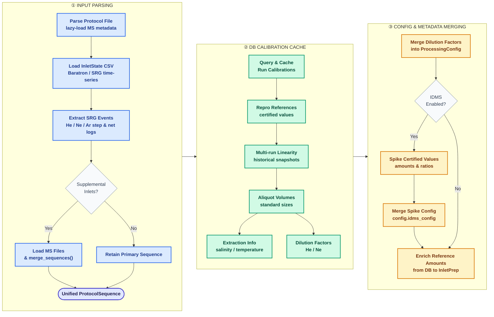
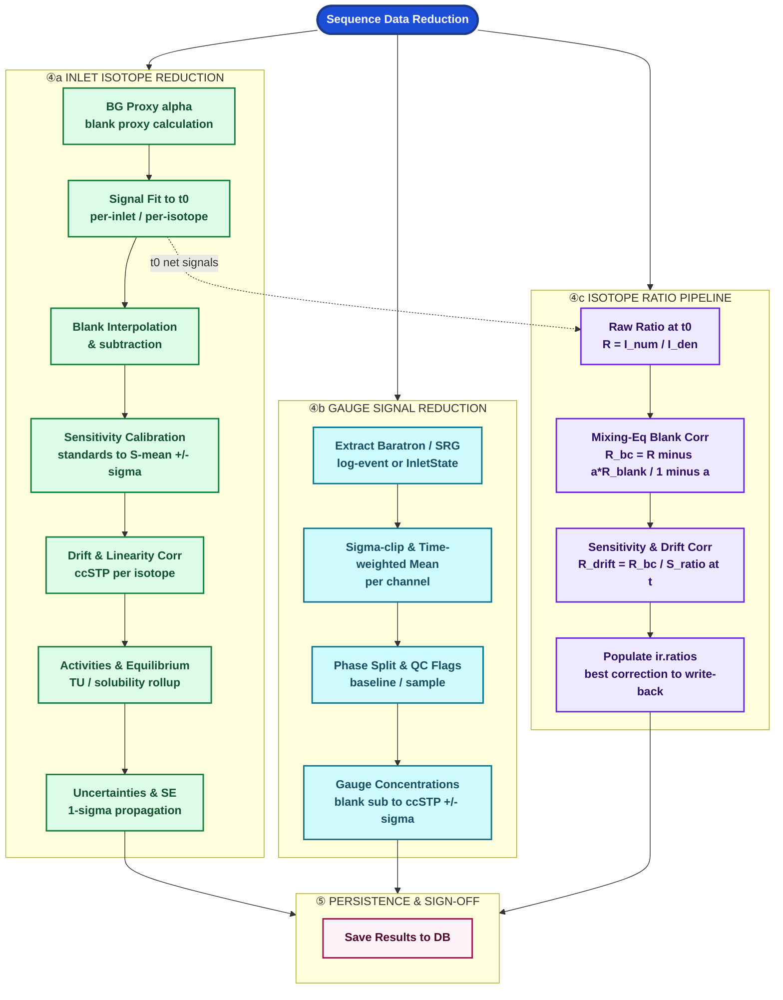

# IsoWorks pyLIMS — User Manual

**Version:** 2025 (PyQt5 / PostgreSQL edition)
**Audience:** Laboratory analysts, technicians, and administrators

---

## Table of Contents

1. [Introduction](#1-introduction)
2. [Getting Started](#2-getting-started)
   2.1 [System Requirements](#21-system-requirements)  
   2.2 [First Launch & Database Connection](#22-first-launch-database-connection)  
   2.3 [Application Interface Overview](#23-application-interface-overview)  
   2.4 [Initial Setup Checklist](#24-initial-setup-checklist)  
3. [Dashboard](#3-dashboard)
4. [Sample Management](#4-sample-management)
   4.1 [Import New Submission](#41-import-new-submission)  
   4.2 [Submission Management](#42-submission-management)  
   4.3 [Stage Samples to TBA](#43-stage-samples-to-tba)  
   4.4 [Manage Analysis Queue](#44-manage-analysis-queue)  
5. [SIAM — Stable Isotope Analysis Module](#5-siam-stable-isotope-analysis-module)
   5.1 [Pre-Analysis Batches (Major Ions / NOx Screening)](#51-pre-analysis-batches-major-ions-nox-screening)  
   5.2 [SIAM Runs](#52-siam-runs)  
   5.3 [Process Run (File-Based Processor)](#53-process-run-file-based-processor)  
6. [TRIMS — Tritium Analysis Module](#6-trims-tritium-analysis-module)
   6.1 [Primary Distillation](#61-primary-distillation)  
   6.2 [Electrolytic Enrichment](#62-electrolytic-enrichment)  
   6.3 [LSC Runs](#63-lsc-runs)  
   6.4 [Evaluation & Finalizing LSC Data](#64-evaluation-finalizing-lsc-data)  
7. [NGAM — Noble Gas Analysis Module](#7-ngam-noble-gas-analysis-module)
   7.1 [3He Ingrowth Runs](#71-3he-ingrowth-runs)  
   7.2 [3He Extraction Runs](#72-3he-extraction-runs)  
   7.3 [3He Measurement Runs (Helix SFT)](#73-3he-measurement-runs-helix-sft)  
   7.4 [NG MS Sequence Runs (NobleControl / Qtegra)](#74-ng-ms-sequence-runs-noblecontrol-qtegra)  
   &emsp;7.4.1 [NG Results View Layout](#741-ng-results-view-layout)  
   &emsp;7.4.2 [Data Reduction Pipeline](#742-data-reduction-pipeline)  
   7.5 [EQW Correction Factors](#75-eqw-correction-factors)  
   &emsp;7.5.1 [Overview](#751-overview)  
   &emsp;7.5.2 [Step 1 — Register and Extract EQW Samples](#752-step-1-register-and-extract-eqw-samples)  
   &emsp;7.5.3 [Step 2 — Enter Extraction Conditions](#753-step-2-enter-extraction-conditions)  
   &emsp;7.5.4 [Step 3 — Run the MS Sequence and Import](#754-step-3-run-the-ms-sequence-and-import)  
   &emsp;7.5.5 [Step 4 — Review CFs and Lock Outliers](#755-step-4-review-cfs-and-lock-outliers)  
   &emsp;7.5.6 [Step 5 — Create a CF Template (Admin)](#756-step-5-create-a-cf-template-admin)  
   &emsp;7.5.7 [Step 6 — Promote to Applied (Admin)](#757-step-6-promote-to-applied-admin)  
   &emsp;7.5.8 [CF Summary Strip](#758-cf-summary-strip)  
8. [QA/QC Module](#8-qaqc-module)
10. [AMS ¹⁴C Module](#10-ams-14c-module)  
   10.1 [Graphitisation](#101-graphitisation)  
   10.2 [AMS Runs](#102-ams-runs)  
   8.1 [Overview & Navigation](#81-overview-navigation)  
   8.2 [Spiked Cells — 3H Enrichment Parameter](#82-spiked-cells-3h-enrichment-parameter)  
   8.3 [Deuterium Recovery — 2H Enrichment](#83-deuterium-recovery-2h-enrichment)  
   8.4 [LS Counter — Reference Standard CPM](#84-ls-counter-reference-standard-cpm)  
   8.5 [Lab Air Moisture & Control Sample](#85-lab-air-moisture-control-sample)  
   8.6 [Reading the Control Chart](#86-reading-the-control-chart)  
   8.7 [Exporting QA/QC Data](#87-exporting-qaqc-data)  
9. [Settings & Administration](#9-settings-administration)
   9.1 [Database Connection](#91-database-connection)  
   9.2 [Employee Management](#92-employee-management)  
   9.3 [Customer Management](#93-customer-management)  
   9.4 [Equipment Management](#94-equipment-management)  
   9.5 [Procedure Management](#95-procedure-management)  
   9.6 [Workflow Management](#96-workflow-management)  
   9.7 [References & Controls](#97-references-controls)  
   9.8 [Global Parameters](#98-global-parameters)  
   9.9 [Reporting Templates](#99-reporting-templates)  

[Appendix A — Privilege Roles](#appendix-a-privilege-roles)  
[Appendix B — Glossary](#appendix-b-glossary)  
[Appendix C — Status Indicators](#appendix-c-status-indicators)  
[Appendix D — Supported File Formats](#appendix-d-supported-file-formats)  
[Appendix E — LSC Counter Setup Guides](#appendix-e-lsc-counter-setup-guides)  
&emsp;E.1 [Quantulus 1220 (WinQ Software)](#e1-quantulus-1220-winq-software)  
&emsp;E.2 [Quantulus GCT / Packard TriCarb (QuantaSmart Software)](#e2-quantulus-gct-packard-tricarb-quantasmart-software)  
&emsp;E.3 [Hidex 300 SL (MikroWin Software)](#e3-hidex-300-sl-mikrowin-software)  

---

## 1. Introduction

**IsoWorks pyLIMS** is a Laboratory Information Management System (LIMS) designed for isotope analysis laboratories, including those participating in IAEA-supported monitoring networks such as GNIP (Global Network of Isotopes in Precipitation). It replaces the legacy MS Access implementation with a cross-platform PyQt5 desktop application backed by a PostgreSQL (or SQL Server) database.

IsoWorks manages the full sample lifecycle — from initial client submission through sample preparation, instrumental analysis, data processing, and final reporting — across four analytical domains:

| Module | Abbreviation | Analytical Technique |
|--------|-------------|---------------------|
| Stable Isotope Analysis | SIAM | IRMS (EA, DI, Laser, Picarro) |
| Tritium Analysis | TRIMS | Electrolysis enrichment + LSC counting |
| Noble Gas Analysis | NGAM | 3He ingrowth (Helix SFT) + Noble Gas MS (Qtegra) |
| AMS ¹⁴C | AMS | Graphitisation sample prep + AMS measurement |
| Quality Assurance / QC | QA/QC | Cross-run control charts (electrolysis, LSC, SIAM) |

IsoWorks is a **modular platform**: a client-server database serves as the central backend, with the PyQt5 frontend connecting over a network or locally. Multiple analysts can work simultaneously on different modules. All analytical results, corrections, and protocol snapshots are stored immutably, supporting ISO 17025 traceability requirements.

---

## 2. Getting Started

### 2.1 System Requirements

| Component | Requirement |
|-----------|-------------|
| Operating System | Windows 10/11, macOS 12+, or Linux |
| Python | 3.10 or later |
| Database | PostgreSQL 14+ (primary), SQL Server, or MS Access |
| Screen resolution | 1280 × 800 minimum; 1920 × 1080 recommended |
| Label printer | DYMO LabelWriter 450 (optional, for sample labels) |

### 2.2 First Launch & Database Connection

On first launch the application cannot load any data until a database connection is configured.

1. Click the **gear icon** (⚙) at the bottom of the left icon bar to open **Settings**.
2. Select **Database Connection** from the sub-module panel.
3. Choose your database dialect:
   - **PostgreSQL** — enter Host, Port, Database name, Username, and Password.
   - **SQL Server** — enter the DSN name.
   - **MS Access** — browse to the `.accdb` / `.mdb` file path.
4. Click **Test Connection** to verify, then **Save**.
5. Restart the application. The connection is restored automatically from saved settings.

> **Note:** Connection credentials are stored in Qt application settings. Do not store passwords in plain-text environment files.

### 2.3 Application Interface Overview

```
┌─────────────────────────────────────────────────────────────────┐
│  Menu bar: File                                                  │
├────┬──────────────────────────────────────────────────────────── │
│    │                                                              │
│ I  │   Sub-Module Panel (240 px, collapsible)                    │
│ c  │   ┌──────────────────────────────────────────────────────┐  │
│ o  │   │  [Module Title]                                      │  │
│ n  │   │  ○ Sub-module A          ← active (highlighted)      │  │
│    │   │  ○ Sub-module B                                      │  │
│ B  │   │  ○ Sub-module C                                      │  │
│ a  │   └──────────────────────────────────────────────────────┘  │
│ r  │                                                              │
│    │   Main Content Area (active module widget)                  │
│    │                                                              │
│ [≡]│                                                              │
│    │                                                              │
│[log│                                                              │
│ ⚙] │                                                              │
└────┴─────────────────────────────────────────────────────────────┘
```

**Icon Bar (leftmost column, dark background)**

Each icon corresponds to a top-level module. Clicking an icon selects that module. If the module has sub-modules, the sub-module panel slides open.

| Icon | Module |
|------|--------|
| Dashboard | Overview charts |
| Sample Management | Submissions, workflows, queue |
| SIAM | Stable isotope runs |
| TRIMS | Tritium pipeline |
| NGAM | Noble gas pipeline |
| QA/QC | Control charts |
| ≡ (top) | Toggle sub-module panel |
| 📋 (near bottom) | View application log |
| ⚙ (bottom) | Settings & administration |

**Sub-Module Panel / Flyout Panel**

Lists the pages within the selected module. Click any item to open it as a workspace tab. The panel collapses after selection to maximise the working area (Settings sub-modules keep the panel open for quick switching).

Several modules use a **flyout** pattern: clicking the module icon slides open a panel with named sub-module items. Sub-modules that support direct run creation show a green **+ New Run** (or **+ New Batch**) sub-item immediately below the list item — clicking it opens a new tab initialised in create mode without navigating through the run list first.

| Module | Flyout sub-items |
|--------|-----------------|
| SIAM | Water Stable Isotopes · + New Water SI Run / Nitrate Stable Isotopes · + New Nitrate Run |
| TRIMS | Primary Distillation · + New Batch / Electrolytic Enrichment · + New Run / LSC Runs · + New Run |
| NGAM | 3He Ingrowth Runs · + New Ingrowth Run / Extraction Runs · + New Extraction Run / MS Sequence Runs · + New Sequence Run / MS Data Reduction |
| AMS ¹⁴C | Graphitisation · + New Graphitisation Batch / AMS Runs · + New AMS Run |

**Main Content Area**

Fills the remaining screen width. Each module is lazy-loaded the first time you visit it.

**Log Viewer**

Clicking the log icon opens a dialog showing the last 1,000 lines of the current session log (`lims_launcher.log`). Use this to diagnose import errors or database issues.

### 2.4 Initial Setup Checklist

For a new laboratory installation, complete these one-time setup tasks (in order) before creating any analytical runs:

| Step | Location | Notes |
|------|----------|-------|
| 1. Configure database connection | Settings → Database Connection | Required before anything else |
| 2. Add employees with privileges | Settings → Employee Management | At least one user with admin rights |
| 3. Add customers / clients | Settings → Customer Management | Required before registering submissions |
| 4. Add equipment / instruments | Settings → Equipment Management | Required before creating runs |
| 5. Add reference materials | Settings → References & Controls | Required for calibration |
| 6. Create procedures | Settings → Procedure Management | Define measurables and load list templates |
| 7. Create workflows | Settings → Workflow Management | Link procedures to sample types / media |
| 8. Set global parameters | Settings → Global Parameters | Default constants for calculations |

> **Tip:** Most of the above are one-time or infrequent operations. Daily routine operations are: register submissions → stage to TBA → create and process analytical runs → report results.

---

## 3. Dashboard

**Path:** Dashboard icon (top of icon bar)

The Dashboard provides a high-level snapshot of current laboratory workload. It refreshes automatically each time you navigate to it.

### Layout

- **Project phase chart** — Shows how many samples are in each phase of the analysis pipeline.
- **Filter controls** — Filter by media type (water, gas, solid, etc.) to focus on a specific analytical stream.
- **Legend** — Color-coded phase labels.

### Sample Phase Summary

| Phase | Meaning |
|-------|---------|
| Registered | Sample received and entered; no workflow assigned yet |
| Pending | Workflow assigned; waiting to be loaded into a run (TBA status) |
| Ongoing | Currently included in an active analytical run |
| Analysed | Instrumental analysis complete; data not yet evaluated |
| Evaluated | Data reviewed and accepted; pending reporting |
| Reported | Final report issued to client |
| Cancelled | Sample removed from the workflow |

---

## 4. Sample Management

**Path:** Sample Management icon → sub-module panel

Sample Management covers everything before a sample enters an instrument run: registering client submissions, organizing samples into analytical workflows, and managing the analysis queue.

---

### 4.1 Import New Submission

**Sub-module:** Import New Submission

Use this module to register a new client submission. Samples can be imported from:

- **LIMS Worksheet** — Import samples from a standard Excel/CSV sheet. 
- **Manual Entry** — Add samples directly into the data grid row by row.
- **JSON** — Direct import from structured JSON files.
- **GNIP format** — Standard Global Network of Isotopes in Precipitation format.
- **From TRIMS** — Import directly from legacy TRIMS databases (by Project # or LSC Run).

#### Workflow

1. **Upload Mode:** Choose whether to *Import a New Submission* or *Append Samples* to an existing project.
2. **Sample Type:** Select *Unknown Samples* or *References/Controls*.
3. **Upload Source:**
   - If importing from Excel, click **Browse** to select the file.
   - Use the **Auto-map** functionality to match file headers to IsoWorks parameters.
   - Review the table and set a uniform **Sample Size** if necessary.
4. **Submission Information:** Select the **Submitter** (Client), **Officer**, **Priority**, and enter a **Submission Name**.
5. **Media & Workflow:** Choose the Media Type (e.g., Water) to dynamically filter available Requested Workflows.
6. **Stage to TBA:** Optionally check "Stage to TBA" to immediately push the samples to the analysis queue after saving.
7. Click **Save Submission** to commit the records to the database.

> **Note:** The `Prefix` and `SampleID` fields together form the unique analysis identifier used throughout IsoWorks (e.g. `IHL-10565`).

#### Submission Properties

| Property | Required | Description |
|----------|----------|-------------|
| **Submission Name** | Mandatory | Unique name for the submission (e.g. project code or job number) |
| **Date** | Mandatory | Date samples were received in the laboratory |
| **Submitter (Client)** | Mandatory | Client or department submitting the samples; must exist in Customer Management |
| **Priority** | Mandatory | Analytical priority (Normal, Rush, etc.) |
| **Requested Workflow** | Mandatory | Determines the analytical pipeline for all samples in the submission |
| Receiving Number | Optional | Internal receiving or accession number |
| Project Manager | Optional | Responsible laboratory manager or officer |
| Payer | Optional | Billing contact if different from the submitter |
| Field Location | Optional | Collection site or project location description |
| Store Location | Optional | Physical storage location of the samples in the laboratory |
| Remark | Optional | Free-text notes on the submission |

#### Sample Properties

Each sample in the submission can have the following properties:

| Property | Required | Description |
|----------|----------|-------------|
| **Sample Name** | Mandatory | Unique name or field label for the sample |
| **Sampling Date** | Mandatory | Date the sample was collected in the field |
| **Sample Type** | Mandatory | Matrix classification (e.g. Groundwater, River, Precipitation, Unknown) |
| Country | Optional | Country of sample collection |
| Latitude | Optional | GPS latitude in decimal degrees |
| Longitude | Optional | GPS longitude in decimal degrees |
| EC (μS/cm) | Optional | Field electrical conductivity; used as quality indicator for distillation |
| Temp (°C) | Optional | Water temperature at time of sampling |
| pH | Optional | Field pH |
| Alkalinity | Optional | Total alkalinity (mg/L as CaCO₃ or meq/L) |
| Sample Volume | Optional | Volume of water submitted (mL); required for volumetric TRIMS calculations |
| Comments | Optional | Any additional field observations |

> **Tip:** Latitude, Longitude, EC, and Alkalinity are particularly important for Noble Gas samples (dissolved gas concentrations depend on temperature and salinity) and for TRIMS samples (EC is used to assess distillation quality).

---

### 4.2 Submission Management

**Sub-module:** Submission Management

Lists all submissions in the database with filtering and search.

#### Interface

| Control | Purpose |
|---------|---------|
| Search box | Filter by submission name, project, client, or date range |
| Table | One row per submission — ID, name, client, date, sample count, status |
| Double-click row | Open **Submission Details** dialog |

#### Submission Details Dialog

- Edit sample metadata (name, collection date, matrix, volume, notes).
- Change the submission status.
- View the workflow assignment status of each sample.
- Print or export the sample list.
- Print DYMO sample labels directly from this window.

---

### 4.3 Stage Samples to TBA

**Sub-module:** Stage Samples to TBA

Assigns an analytical **Workflow** to one or more samples, moving them from *Registered* → *Pending* status (TBA = To Be Analysed). This makes samples available for inclusion in an instrument run.

#### Workflow

1. Use the filter (by project, media, date range) to locate unassigned samples.
2. Select one or more samples in the left table.
3. Choose the appropriate **Workflow** from the dropdown (e.g. "δ²H δ¹⁸O Water", "³H Tritium Standard", "Dissolved Noble Gases").
4. Set the analysis **Priority** if required.
5. Click **Assign Workflow**. The samples move to the TBA queue and their status changes to *Pending*.

> **Tip:** Workflows bundle together the complete sequence of analytical steps. Assigning the correct workflow is essential — it determines which modules can process these samples and in what order.

---

### 4.4 Manage Analysis Queue

**Sub-module:** Manage Analysis Queue

Shows all samples currently in TBA (Pending) status — workflow-assigned but not yet loaded into an instrument run.

#### Controls

| Control | Purpose |
|---------|---------|
| Filter by Media | Show only water, gas, solid, etc. |
| Filter by Workflow | Show only samples for a specific workflow |
| Search | Find by Sample ID or Sample Name |
| Priority | Change analysis priority for a sample |
| Remove from Queue | Un-assign a sample's workflow; returns it to Registered status |

Use this view to verify which samples are waiting, check counts before creating a run, and remove samples mistakenly staged for analysis.

---

## 5. SIAM — Stable Isotope Analysis Module

**Path:** SIAM icon → flyout → **Water Stable Isotopes** (δ¹⁸O / δD, mediaid = 1) or **Nitrate Stable Isotopes** (δ¹⁵N / δ¹⁸O, mediaid = 58)

SIAM manages the complete analytical workflow for stable isotope measurements by Isotope Ratio Mass Spectrometry (IRMS) and laser spectroscopy. It covers the full chain: sample registration, load list preparation, instrumental analysis (tray autosampler or water equilibration), multi-step data correction, calibration against international reference materials (VSMOW, SLAP2, VPDB, AIR), and final storage of calibrated δ values with propagated uncertainties in the database.

**Measurables supported:** δ²H and δ¹⁸O (water by CRDS/OA-ICOS laser or equilibration-IRMS), δ¹⁷O (water), δ¹³C and δ¹⁵N (dissolved nitrate, organic matter, solids via EA-IRMS), δ³⁴S, and any custom isotope ratio configured through the procedure system.

**Supported instrument families:**

| Family | Typical instruments | File format |
|--------|-------------------|-------------|
| Picarro CRDS | L1102-I, L2120-I, L2130-I, L2140-I | Comma-separated ASCII (Chemcorrect export) |
| LGR OA-ICOS | DT-100, T-LWIA-45-EP | ASCII `.txt` or `.csv` |
| Thermo IRMS (Dual Inlet / CF) | MAT 253, Delta V Plus, Finnigan MAT | Isodat NT 1.6/2.0 `.xls`/`.xlsx` workbook |
| EA-IRMS | Elementar vario ISOTOPE select | Isotopedb `.csv` or `.xlsx` |

IsoWorks automatically detects the file format from the header of the imported data file and selects the appropriate parser and column mapping.

**Required privilege:** `accesssiam` (create/edit), `siamadmin` (delete)

---

### 5.1 Pre-Analysis Batches (Major Ions / NOx Screening)

**Sub-module:** Pre-Analysis Batches

Some workflows (e.g. δ¹⁵N and δ¹⁸O of dissolved nitrate) require a **Major Ions / Chemistry pre-screening** step to confirm sufficient NOx (or other target compound) before proceeding to IRMS analysis. This module manages those screening batches.

#### Interface Layout

- **Top bar (right-aligned):** New Batch · Refresh · Close
- **Filter group:** "Open batches only" checkbox + merged **Search / Open Batch** button + **Delete** button
- **Table:** Run ID, Procedure, Instrument, Start Date, End Date, Samples, Status

#### Creating a New Pre-Analysis Batch

1. Click **New Batch** (requires `accesssiam` privilege).
2. In the **Create Pre-Analysis Batch** dialog:
   - Select the **Procedure** (e.g. "IC Major Ions NOx").
   - Select the **Instrument** (e.g. "Ion Chromatograph 1").
   - Set the **Start Date/Time**.
   - Add samples to the load list from the TBA queue.
3. Click **Save**. The batch opens automatically in the details view.

#### Opening a Batch

- Click a row → Run ID fills the search box → click **Open Batch**; or
- Double-click any row directly.

The button label is dynamic:

| Search Type active | Button label |
|--------------------|-------------|
| Run ID | **Open Batch** |
| Sample Name | **Search** |

#### Outcomes

Samples that meet the NOx threshold become available for SIAM analysis. Samples below threshold are flagged in the details view and excluded from the SIAM queue.

---

### 5.2 SIAM Runs

**Sub-module:** Water Stable Isotopes · Nitrate Stable Isotopes

The SIAM run list is opened from the flyout. Selecting **Water Stable Isotopes** automatically filters the run list to water media (mediaid = 1); selecting **Nitrate Stable Isotopes** filters to nitrate media (mediaid = 58). The **+ New Run** flyout sub-item opens the same view directly in create mode.

#### Run List Interface

| Control | Purpose |
|---------|---------|
| **Create New Run** (green) | Opens the Create Run dialog |
| **Finalize Run** (orange) | Review repeats & acceptance criteria, then lock the run |
| **Close** | Close the module |
| **Filter — Job Name** | Filter by workflow job (e.g. "Stable_Isotopes") |
| **Filter — Media** | Filter by sample media type |
| **Show Ongoing Runs Only** | Hide completed runs |
| **Search By / text box** | Search by Run ID, Sample ID, Sample Name, or Project Name |
| **Open Run / Search** | Dynamic label: "Open Run" when searching by Run ID |
| **Import** | Launch the file-based data processor for the selected run |
| **Delete** | Delete the selected run (requires `siamadmin`) |
| Double-click row | Open **Run Details** window |

Clicking a row in the table automatically populates the search box with the Run ID and switches the search type to "Run", making the button show "Open Run".

#### Status Indicators

| Dot | Status |
|-----|--------|
| 🟠 Orange | Ongoing — no end time recorded |
| 🟢 Green | Complete — end time present |

#### Creating a New SIAM Run (Batch Setup)

Creating a Run (or Batch) is the foundational first step in the analytical pipeline. It consumes samples from the TBA (Pending) queue, assigns them to a specific instrument, and maps them onto a structured **Load List** based on a predefined **Procedure Template**. This step transitions samples from *Pending* to *Ongoing*.

1. Click **Create New Run**.
2. The dialog has three panels:

   **Left Panel — Run Setup**

   | Field | Description |
   |-------|-------------|
   | Run ID | Auto-assigned; read-only |
   | Workflow | Select from available workflows for the job and media |
   | Equipment | Select the IRMS or laser instrument |
   | Technician | Defaults to the logged-in user |
   | Start Date/Time | Defaults to now; editable |
   | Procedure | Analysis procedure; links to the load list template |
   | Edit Load List Template… | Opens the template editor for the selected procedure |
   | Remarks | Free-text notes |

   **Middle Panel — Transfer Controls**

   | Button | Action |
   |--------|--------|
   | `>` | Move selected sample(s) to the load list |
   | `<` | Remove selected sample(s) from the load list |
   | `>>` | Add all available samples |
   | `<<` | Remove all samples from the load list |

   **Right Panel — Load List / Tray View**

   Displays the current run positions as a table (position, type, Lab ID, Sample Name) and optionally as an **interactive tray grid** where each vial is shown as a colour-coded circle:

   | Colour | Vial type |
   |--------|----------|
   | Blue | Standard / reference material |
   | Green | Unknown sample from TBA queue |
   | White / empty | Unassigned (floating) position |

   Right-clicking a circle opens a context menu to reassign the position type, swap samples, or clear the slot.

   - If fewer samples are available than the template requires, the remaining positions are left as *floating* (empty) slots. They can be filled later from the TBA queue or converted to additional standard replicates.
   - Click **Add Control Sample** to insert extra standards, blanks, or spikes at specific positions without consuming TBA samples.
   - Click **Auto Fill** to automatically load the highest-priority TBA samples into all available sample-type positions.

3. Click **Save Run** to commit. The run appears in the run list with *Ongoing* status.

#### Export Load List

Once a run is created, the load list can be exported as a CSV file for direct import into the instrument's autosampler control software (e.g., to pre-program the Picarro tray or the EA-IRMS autosampler sequence). Click **Export CSV** in the run details window. The exported file includes position number, vial type, Lab ID, and sample name — the column order matches the conventions of the most common software packages.

#### Load List Template Editor

Access via **Edit Load List Template…** in the Create Run dialog, or via **Settings → Procedure Management**.

The template editor shows all tray/vial positions with their assigned sample type. Right-click a vial to:

- Assign a standard or control sample to that position.
- Assign a block of unknown sample positions.
- Set repeat positions for control samples.
- Configure the number of injections and aliquot volume per position.

#### Finalizing a Run

Select a completed run and click **Finalize Run**. The Finalize dialog:

- Lists all samples with their measured values and repeat counts.
- Flags samples needing repeats (where measured count < required repeats).
- Allows accepting/rejecting individual measurements.
- Clicking **Finalize** sets the run end time and locks the record (*Complete* status).

---

### 5.3 Process Run (File-Based Processor)

**Sub-module:** Process Run (File-Based Processor)

The processor widget imports raw IRMS data files, applies corrections, calibrates results, and stores final isotope ratios in the database.

#### Supported File Formats

| Instrument Class | Software / Format | Parsing Logic & Handling |
|-----------------|------------------|--------------------------|
| **Lasers (Picarro)** | CRDS / Comma-separated ASCII | Maps generic names to analytical parameters. Detects multiple isotopes per injection. Extracts ignored rows and outliers. |
| **Lasers (LGR)** | OA-ICOS / ASCII `.txt` or `.csv` | Automatically identifies Block, Line, and Gas Concentration columns. |
| **IRMS (Thermo DI)** | Isodat NT `.xls` or `.xlsx` | Supports **multi-sheet** workbooks. Automatically reads each sheet as a separate isotope (e.g., δ18O on sheet 1, δD on sheet 2) and merges them by Sample ID. |
| **IRMS (EA)** | Elementar/Isotopedb `.csv`, `.xlsx` | Filters data by **Peak Number**. If multiple peaks exist, users select the target peak for Carbon vs Nitrogen calculation via the UI. |

IsoWorks automatically detects the instrument format based on the file header. It applies pre-processing rules, such as mapping variations of identifiers (`Identifier 1`, `Sample ID`, `Ref Name`) into a canonical `sample_id` used internally.

#### Processing Steps

1. **Option & Format:** Select "LIMS-Based" to connect the data to an existing run, or "File-Based" for standalone processing.
2. **Files:** 
   - **LIMS-Based:** Select the DSN and Run ID. IsoWorks fetches the load list, true values, and standard roles directly from the database.
   - **File-Based:** Load the raw **Data** file and the corresponding **Standards** file (CSV/JSON/XLSX).
3. **Active Isotope:** The UI dynamically lists available isotopes present in the file (e.g., δ18O, δD, δ13C, δ15N). Toggling this changes the displayed raw/analysis tables and QC plots.
4. **Protocol Management:** Load an existing processing protocol or apply ad-hoc settings.
5. **Post-Processing Configuration:**
   - **Laser Settings:** Choose Memory, Drift, and Linearity correction models. Configure outlier detection.
   - **IRMS Settings:** Choose EA Linearity (Amount) and Drift (Time/Order) models. Select the preferred EA Peak per isotope. Check **Robust fits (Huber)** to minimize the leverage of severe outliers on the standard calibration curves.

6. **Process Data:** Executing this applies a rigorous, ordered pipeline to the data.

#### The Correction Pipeline

Data is corrected in a specific sequence to prevent mathematical distortion. The pipeline evaluates the data as follows:

`Raw Data  ──►  Outlier Removal  ──►  Memory Correction  ──►  Drift Correction  ──►  Linearity Correction  ──►  Calibration`

**1. Outlier Rejection (Laser-Specific)**
- Evaluates replicate injections within a single sample block.
- **Available Methods:**
  - **Chauvenet:** Probabilistic criterion (highly recommended).
  - **Modified Z-Score:** Uses Median Absolute Deviation (MAD), highly robust against single massive outliers.
  - **X_STDV:** Simple sigma cutoff.
  - **Dixon/Grubbs/GESD:** Classical single and multi-outlier tests.

**2. Memory / Carryover Correction (Laser-Specific)**
- Corrects for the physical carryover of water vapor or gas from the preceding sample into the current sample.
- **Available Models:**
  - **1-Reservoir (Single Pool):** Models a single flushing pool using an exponential decay term.
  - **Fast/Slow Pool Carryover:** A bi-exponential model accounting for both the rapidly flushed optical cavity and slowly desorbing memory from the tubing/walls.
  - **Asymptotic / Skip:** Discards early injections and averages the final stable readings.
- **Memory Factor Fitting and Stages:**
  - In *Pool-based models* (Single Pool and Fast/Slow Pool), the processor normalizes and averages all high-contrast transitions between consecutive memory standards to fit a single set of carryover parameters. This main averaged fit is indexed under key `"0"` (Stage 0) in the visual diagnostics tab.
  - In *Intra-sample models* (e.g. Exponential/Asymptotic sample-by-sample corrections), the memory factors can be calculated individually for each sample transition, resulting in multiple indices (Stage 0, Stage 1, etc.). Use the "Carryover Stage" selector in the plots view to inspect individual fitted transitions.
- **Automatic Standard Role Assignments:**
  If standard roles (Memory, Calibration, Drift, and Validation/Control) are not explicitly mapped in the LIMS load list, the processor automatically detects and assigns them based on certified true values and run positions:
  - *Memory Standards*: The processor automatically selects the largest certified contrast pair ($|\Delta \delta^{18}\text{O}_{\text{true}}|$) measured consecutively at the beginning of the batch.
  - *Calibration Standards*: The high and low certified standard anchors that define the widest bracket are selected.
  - *Drift Standards*: The best run-spanning standard measured at least twice is chosen.
  - *Validation / Control*: An independent control standard not used in any correction role is chosen.

**3. Linearity / Amount Correction (IRMS EA / Laser)**
- Corrects for isotopic fractionation caused by differing sample sizes (e.g., variations in peak area or water concentration).
- Fits a model to the **Linearity Standards** (samples flagged as `is_linearity_id`).
- **Available Models:** 
  - **Linear:** $\delta_{corrected} = \delta_{measured} - (m \times \text{Amount} + c)$
  - **Quadratic (EA only):** Adds a squared term for extreme amplitude dependency.

**4. Drift Correction (IRMS / Laser)**
- Corrects for slow, systematic shifts in instrument tuning or source tuning over the duration of the batch.
- Fits a trendline to the **Drift Standards** (samples flagged as `is_drift_id`).
- **Available Models:**
  - **Linear (Time):** Fits against the continuous injection timestamp.
  - **Linear (Order):** Fits against the sequential injection number or block index.

**5. Calibration**
- Projects the corrected instrumental δ values onto the recognized international scale (e.g., VSMOW-SLAP for water, VPDB for Carbon).
- Evaluates **Calibration Standards** (`is_calibration_id`) against their known true values.
- Yields the standard equation: $\delta_{calibrated} = m \times \delta_{corrected} + c$. 
- Calibrated values are output with their calculated combined standard uncertainty ($u_c$).

#### Post-Processing Results Table

After processing completes, the **Results** tab shows one row per sample with the following columns:

| Column | Description |
|--------|-------------|
| **Sample ID** | Laboratory identifier |
| **Sample Name** | Field name or description |
| **Lin** | ✓ if linearity correction was applied |
| **Mem** | ✓ if memory / carryover correction was applied |
| **Drft** | ✓ if drift correction was applied |
| **Norm** | ✓ if scale normalization (calibration) was applied |
| **Raw δ** | Mean of raw replicate injections (‰), before any correction |
| **Corr δ** | δ value after all enabled correction steps (‰) |
| **Final δ** | Calibrated δ on the international scale (e.g. VSMOW) (‰) |
| **u_c** | Combined standard uncertainty (‰), accounting for all correction steps |
| **Z-score (ζ)** | (Final δ − certified) / σ_certified for independent control standards |
| **BIk** | ✓ if injection used as an inter-sample memory blank |
| **IG** | ✓ if the sample or injection was manually ignored |
| **Instr. Error** | Within-block instrumental reproducibility (1σ of replicates, ‰) |

Row background colouring for control standards (Z-score):
- Green — |ζ| ≤ 2.0 (PASS)
- Yellow — 2.0 < |ζ| ≤ 3.0 (WARNING)
- Red — |ζ| > 3.0 (FAIL — investigate instrument or sample)

#### Validation & QA/QC

Once processing completes, IsoWorks computes validation metrics using the independent **Control Standards** (`is_control_id`).

1. **Residuals:** Calculated as $(\delta_{calibrated} - \delta_{true})$.
2. **Z-Scores (Zeta test):** $\zeta = \frac{(\delta_{calibrated} - \delta_{true})}{\sigma_{true}}$
   - $|\zeta| \leq 2$: **PASS** (Green)
   - $2 < |\zeta| \leq 3$: **WARNING** (Yellow)
   - $|\zeta| > 3$: **FAIL** (Red)

Visual diagnostic charts are available in the **Plots & Reports** tab:

| Chart | Description |
|-------|-------------|
| **Raw Signals** | Measured signal (δ) vs. run position for all injections |
| **Time Series** | Full temporal view of raw, memory-corrected, or final calibrated signals |
| **Memory Fit** | Cycle-by-cycle signals within each sample block overlaid with the fitted carryover decay curve; reveals the magnitude of isotopic memory and the quality of the model fit |
| **Drift Fit** | Drift standard residuals (after memory correction) plotted vs. run time or injection order, with the fitted trend line; a flat residual plot indicates no detectable drift |
| **Linearity** | Measurement deviation plotted vs. Sample Amount (peak area or water concentration); non-linearity appears as a sloped trend through the linearity standard points |
| **Calibration** | δ (measured, post-correction) vs. δ (accepted) for calibration reference materials; the VSMOW and SLAP2 anchors are highlighted; the regression line shows the normalization scale |
| **Dual Isotope Scatters** | e.g., δ¹⁸O vs. δ²H with the Global Meteoric Water Line (GMWL) overlay; useful for screening sample integrity and comparing field samples to the expected meteoric water relationship |

**Normalize button** — Re-applies the normalization step using the currently selected calibration standard set without re-running the earlier correction steps. Use this to compare different combinations of calibration anchors (e.g. VSMOW-only vs. VSMOW+SLAP2).

**Save to Database** — Click to push the calibrated δ means, combined uncertainties, correction metadata (slopes, intercepts, R²), and an immutable JSON snapshot of the protocol parameters to the SQL database. The run status changes from *Ongoing* to *Evaluated*. A summary dialog reports the number of sample records written.

> **Note:** Once saved, the correction coefficients are stored permanently with the run record. Re-processing the run and saving again overwrites the previously stored values — IsoWorks does not keep a version history of processor outputs for the same run.

---

## 6. TRIMS — Tritium Analysis Module

**Path:** TRIMS icon → sub-module panel

TRIMS manages the complete analytical workflow for environmental tritium (³H) measurement by Liquid Scintillation Counting (LSC). The pipeline has three mandatory sequential stages followed by an evaluation and finalization step:

```
Primary Distillation  ──►  Electrolytic Enrichment  ──►  LSC Counting  ──►  Evaluate & Finalize
```

Water samples are first purified by distillation to remove dissolved salts and organic contaminants, then electrolytically enriched to increase the ³H concentration by a factor of β (typically 20–30×), and finally measured on a liquid scintillation counter. The combination of electrolytic enrichment and ultra-low-background counting allows detection limits as low as 0.05 TU under optimized conditions.

Samples advance through each stage automatically as they are marked complete — the Is Pre-Requisite flag on each workflow job enforces that distillation must pass quality criteria before enrichment can begin, and enrichment must complete before LSC counting.

**Required privilege:** Standard analyst access is inherited from the workflow assignment; destructive operations (delete runs, override statuses) require elevated privileges configured by the administrator.

---

### 6.1 Primary Distillation

**Sub-module:** Primary Distillation

Primary distillation purifies water samples by removing dissolved salts, organic compounds, and volatile impurities that would otherwise interfere with the electrolytic enrichment step. It simultaneously concentrates the sample to the volume required by the electrolysis system. Each **Distillation Batch** tracks the process for up to 20 samples (or as configured per distillation system) run through a glass-manifold distillation apparatus.

#### Run List Interface

The sidebar shows all distillation runs with colour-coded status dots. Toggle **Show All** to include completed runs. A **search input** above the list filters by run ID or procedure name (client-side, no round-trip required).

**Run list columns:**

| Column | Description |
|--------|-------------|
| Run ID | Unique identifier for the distillation batch |
| System | Distillation system (manifold) used |
| Procedure | Distillation method and target sample volume |
| Date Start | Date and time the batch was started |
| Date End | Date the batch was completed (blank if in progress) |
| Samples | Number of sample positions in the batch |
| Status | Open (in progress) or Complete |

#### Creating a Distillation Batch

1. Click **New** (or **Distillation → New**).
2. Select a **Workflow** — this automatically selects the associated distillation method and sets the default sample volume.
3. Select the **Distillation System** (if overriding the workflow default). This determines:
   - The total number of flask positions.
   - Available positions in the current run.
4. The **List of Ready Samples** shows samples in TBA status that match the workflow and volume. If samples failed in a previous run and were flagged for repeat, they appear in the **Failed Samples** list at the top.
5. Transfer samples to the run:
   - Double-click individual samples, or
   - Click `>>` to automatically fill the required number by priority.
6. Click **Create Run** to save and close the creation dialog.

#### Entering Distillation Data

Open a run (double-click or Load). Click **Edit** to enter edit mode.

- Click the **Edit EC** (electrical conductivity) pencil button to enter conductivity values before and after distillation.

  **EC Acceptance Criteria:**

  | Condition | Threshold | Action |
  |-----------|-----------|--------|
  | Post-distillation EC | < 20 μS/cm | Distillation successful — sample passes to enrichment |
  | Post-distillation EC | 20–50 μS/cm | Monitor; may be acceptable depending on sample type |
  | Post-distillation EC | > 50 μS/cm | Re-distillation recommended |
  | Pre-distillation EC | Very high (e.g. > 5,000 μS/cm) | Dilute before distillation; note in remarks |

  High post-distillation EC indicates that dissolved salts, organic compounds, or volatile impurities were not fully removed, which may affect the electrolytic enrichment step.

  > **Procedure-configurable threshold:** The **Maximum Accepted EC** is a procedure-level parameter set in **Settings → Procedure Management**. The default is 60 μS/cm; laboratories may tighten or relax this based on sample matrix and enrichment system sensitivity. Samples with post-distillation EC above the threshold are automatically flagged for repeat distillation and cannot proceed to the enrichment queue until re-distilled or manually overridden by an authorised user.

- Change the **Status** for each sample:

  | Status | Meaning |
  |--------|---------|
  | Distilled Success | Distillation completed satisfactorily |
  | Repeat | To be re-distilled in a future batch |
  | Cancelled | Sample repeatedly failed; removed from workflow |

- Enter the **End Date** using the date picker.
- Click **Save Edits**.

#### Labels and Printing

- Click **Labels** to print DYMO sample labels for distilled bottles.
- Click **Print** to print the run report (positions, sample IDs, EC values).

---

### 6.2 Electrolytic Enrichment

**Sub-module:** Electrolytic Enrichment

Electrolytic enrichment concentrates tritium by electrolysis of the distilled water sample. IsoWorks organises enrichment runs by a physical **electrolysis system** (a tray of cells).

#### Run List Interface

The sidebar lists all enrichment runs. A **search input** above the list filters by run ID or procedure name (client-side).

#### Run Status Indicators

| Dot | Status |
|-----|--------|
| 🔴 Red | Pending — cells being filled / prepared |
| 🟠 Orange | Ongoing — enrichment in progress |
| 🟢 Green | Complete — enrichment finished |

#### Creating an Enrichment Run

1. Click **New** (or **Electrolysis → New**).
2. Select the **Electrolysis System** (e.g. 100-cell unit). The associated default procedure is automatically selected.
3. Review the procedure parameters:
   - Number of cells in the system.
   - Number of spikes in the procedure.
   - Cell start ID.
   - Spike sample ID.
   - Last spiked cell ID (rotates automatically each run; shows -9999 on first run).
4. The **List of Ready Samples** shows successfully distilled samples matching the workflow and volume.
5. Transfer samples:
   - Double-click or `>` for individual samples.
   - `>>` to auto-fill required number by priority.
6. Click **Add Control Sample** to add standards (spike, dead water, tap water) at specific cell positions.
7. Click **Create Run**.

#### Entering Gravimetric Data

Open the run → **Edit** → enter data for each cell:

- Initial and final water weights (gravimetric determination of the electrolysis factor).
- W_final (volume of enriched water collected).
- Run remarks and technician names.
- **End Date/Time** when enrichment is complete.

Click **Stop Edit → Save**.

#### Deuterium Enrichment Method (Optional)

If the laboratory has IRMS or laser capability for δ²H measurement, the Deuterium enrichment factor method can be used instead of (or in addition to) the gravimetric spike method.

**Scientific Basis**

Electrolytic enrichment of tritium (³H) proceeds in close parallel with the enrichment of deuterium (²H) from the same water sample. The strong linear relationship between ³H enrichment (β) and ²H enrichment (as expressed through δ²H) allows a cell-specific enrichment conversion factor *k* to be determined from δ²H measurements alone. This approach is described in:

- Wassenaar, L.I., Hendry, M.J., Chostner, V.L., and Lis, G.P. (2016). High resolution pore water δ²H and δ¹⁸O measurements by H₂O(liquid)-H₂O(vapor) equilibration laser spectroscopy. *Rapid Communications in Mass Spectrometry*, 30(3), 415–422.
- Coplen, T.B. and Wassenaar, L.I. (2015). LIMS for Lasers 2015 for achieving long-term accuracy and precision of δ²H, δ¹⁷O, and δ¹⁸O of waters using laser absorption spectrometry. *Rapid Communications in Mass Spectrometry*, 29(22), 2122–2130.

> **Instrument requirement:** The laser analyzer (Picarro or LGR) must be capable of measuring δ²H values up to approximately +50,000 ‰ VSMOW to cover the enriched samples without signal saturation or memory artifacts. Pre-enrichment water (unenriched blank) must also be measured for baseline correction.

**Procedure in IsoWorks**

1. From the enrichment run, click **Deuterium**.
2. Confirm adding pre-enrichment samples to the SIAM TBA queue.
3. After SIAM analysis completes, click **Get SIAM Data** to import δ²H values.
4. Click **Compute Enrichment Factor** to calculate the deuterium-based β factor.

Recovery thresholds (configurable in Settings):
- **Warning:** δ²H recovery < 70% — cell needs monitoring.
- **Critical:** δ²H recovery < 50% — cell likely needs reconditioning.

Cell constants (β) are managed under **Settings → Equipment Management → Cells → Cell Constants**.

---

### 6.3 LSC Runs

**Sub-module:** LSC Runs

Liquid Scintillation Counting measures the tritium activity of enriched water samples. IsoWorks supports multiple LSC instrument vendors.

#### Run List

The sidebar lists all LSC runs. A **search input** above the list filters by run ID or procedure name (client-side).

#### Run List Status Indicators

| Dot | Status |
|-----|--------|
| 🟡 Yellow | Being counted — run in progress |
| 🔴 Red | Expected end date passed — data not yet imported |
| 🟢 Green | Counting complete and data processed |

#### Supported LSC File Formats

| Vendor / Counter | Format |
|-----------------|--------|
| Packard / TriCarb (no header) | Plain text |
| Packard / TriCarb (with header) | Plain text |
| Quantulus GCT | Text |
| Quantulus 1220 Registry | Text |
| Quantulus 1220 Spectral | Text |
| Hidex 300 SL | Matrix export `.xlsx` |
| Aloka / Hitachi | `.csv` |

#### Creating an LSC Run

1. Click **New** (or **Counting → New**).
2. Select the **LSC Counter** — the default procedure for that counter auto-selects.
3. Review the procedure parameters:
   - Samples per run.
   - Number of standards, backgrounds, spikes, and lab-air moisture vials.
4. The **List of Ready Samples** shows enriched samples matching the procedure.
   - To override, check **Show All Samples** to display all possible samples.
   - Change the **Sample Status** filter to include samples with non-default status.
5. Transfer samples:
   - Double-click or `>` to select individually.
   - `>>` to auto-fill by priority.
6. Click **Add Control Sample** to add backgrounds, efficiency standards, or other controls at specific positions.
7. Optionally click **New Template** to override the default procedure template for this run only.
8. Click **Create Run**.

#### LSC Run Window Tab Structure

The run window has four tabs; the Evaluate and Finalize tabs become visible only after count data have been imported:

| Tab | Always visible | Content |
|-----|---------------|---------|
| **Load List** | Yes | Sample positions, vial types, Lab IDs, and expected count times |
| **Import** | Yes | File browser, format selector, CPM window, outlier detection |
| **Evaluate** | After import | Count data review, Compute Run, Run Computed Data header |
| **Finalize** | After import | Enrichment factor selection, final ³H results, Write Final Results |

#### Importing LSC Count Data

From the **Import** tab:

1. Click **Browse** and select the LSC output file.
2. Select the **File Format** and the **Separator Character** (comma, semicolon, etc.).
3. Click **Import/Load** to parse the file into the import window.
4. Select the optimal **CPM Window** (energy range, keV) for tritium counting.
5. Select the **Quench Indicator Parameter** (e.g. tSIE, SQP, SIS).
6. Select the **Outlier Detection Method**:
   - IsoWorks supports the **Modified Z-Score method** (Iglewicz and Hoaglin, 1993) as well as standard sigma-based tests. The Modified Z-Score uses the Median Absolute Deviation (MAD) for robust outlier flagging — it is not distorted by the outliers themselves and is the recommended default for low-activity tritium counting.
   - A cycle flagged as a possible outlier is marked with a red indicator in the per-sample count table.
   - Use the navigation arrows (◄ / ►) to browse individual samples; manually mark or unmark individual cycles as outliers before saving.
7. Set **Net CPM and/or DPM** import options and the **Activity Unit** (TU or Bq/L).
8. Click **Save** to store the count data in the database.

> **Figure of Merit (FOM):** The optimal energy window for tritium counting is determined by maximising the **Figure of Merit**:
>
> $$\text{FOM} = \frac{E^2}{B}$$
>
> where *E* is the counting efficiency (fraction of tritium decays detected) and *B* is the background count rate (CPM) in that window. A higher FOM means a better signal-to-noise ratio. The FOM is counter-specific and should be redetermined after any counter servicing or window change. Save the optimal window bounds as a global parameter for re-use across runs.
>
> **Counter-specific window guidance:**
>
> | Counter | Window type | Typical setting |
> |---------|------------|-----------------|
> | Quantulus 1220 | MCA channels | Windows 1 & 2 (Group 1): optimized FOM channels; Windows 7 & 8 (Group 2): 1–1024 full spectrum |
> | Quantulus GCT / Packard TriCarb | keV | Window A: 0.5–18.5 keV (full tritium range); Window B: 0–3.0 keV (empirically determined max FOM; verify per counter) |
> | Hidex 300 SL | keV | TDCR method — use Digital Pb-shield + Chemiluminescence-free ROI for lowest background and outlier risk |

#### LSC Protocols

Protocols are managed via **Settings → Procedure Management → LSC Protocol Editor**. Each protocol specifies:

- Counting window (energy range in keV).
- Count duration (minutes per cycle).
- Background value (CPM) and number of background vials.
- Counter efficiency and quench correction method (TSIE, SIS, or tSIE).
- Number of samples, spikes, and standards per run.

---

### 6.4 Evaluation & Finalizing LSC Data

After importing count data, navigate to the **Evaluate** tab.

#### Evaluate Tab

The Evaluate tab displays the count data organized by vial type and provides the tools to compute the final tritium activities.

**Count data table columns:**

| Column | Description |
|--------|-------------|
| Pos | Vial position in the run |
| Lab ID | Sample laboratory identifier |
| Type | Background / Spike / Standard / Sample |
| CPM (per cycle) | Individual cycle count rates; outlier cycles shown in red |
| Mean CPM | Mean across all accepted (non-outlier) cycles |
| Net CPM | Background-subtracted CPM |
| σ_CPM | Combined statistical counting uncertainty (1σ) |
| Outlier | Flag count (n cycles rejected) |

**Outlier Detection Reference**

IsoWorks uses the **Modified Z-Score method** (Iglewicz, B. and Hoaglin, D., 1993. *How to Detect and Handle Outliers*, ASQC Quality Press, Milwaukee) for cycle-level outlier detection. Unlike the classical Z-score which uses the sample mean and standard deviation — both influenced by the very outliers under test — the Modified Z-Score is defined as:

$$M_i = \frac{0.6745 \cdot (x_i - \tilde{x})}{\text{MAD}}$$

where $\tilde{x}$ is the median of the cycle values and MAD = median(|x_i − x̃|). A cycle with |M_i| > 3.5 is flagged as an outlier. This robust approach is particularly valuable in low-activity tritium counting where even a single chemiluminescence or phosphorescence spike can severely distort the sample mean.

**Click Compute Run** to calculate:

1. **Mean Background CPM** — arithmetic mean of all accepted counting cycles across all background vials.
2. **Counter Efficiency** — derived from certified efficiency standards: E = (net CPM) / (known DPM).
3. **Enrichment Factors** — applied from the selected method (see Finalize tab).
4. **Decay correction** — $A_0 = A_{measured} \times e^{\lambda t}$, where λ = 1.782 × 10⁻⁹ s⁻¹ (³H decay constant) and *t* is the elapsed time from collection date to counting date.
5. **Final ³H activity [TU]** — computed for each analytical sample with full uncertainty propagation.

After computation, the **Run Computed Data** header strip updates with summary statistics:

| Field | Description |
|-------|-------------|
| **Mean Background** | Average CPM across all background vials in this run |
| **Counter Efficiency** | Mean counting efficiency (%) from efficiency standard vials |
| **Spike [TU]** | Computed ³H activity of the spike standard vials (TU) |
| **Standard [TU]** | Computed ³H activity of the working standard vials (TU) |
| **FOM [E²/B]** | Figure of Merit for the selected CPM window (see [§6.3 LSC Runs](#63-lsc-runs)) |
| **LC/LLD [CPM]** | Lower Countable Level / Lower Limit of Detection in CPM |
| **MDA [DPM/kg]** | Minimum Detectable Activity in disintegrations per minute per kilogram |

**Minimum Detectable Activity (MDA)**

The MDA is the lowest ³H activity that can be reliably distinguished from background noise at a specified confidence level. IsoWorks calculates it as:

$$\text{MDA} = \frac{k_\alpha + k_\beta}{\sqrt{t_c}} \cdot \frac{\sqrt{2B}}{E \cdot \text{EF} \cdot V}$$

where k_α = k_β = 1.645 (5% false-positive / false-negative risk), *t_c* is the counting time per cycle (min), *B* is background CPM, *E* is counter efficiency, EF is the enrichment factor, and *V* is the sample volume (L). A lower MDA requires longer counting times, lower backgrounds, higher efficiency, and higher enrichment.

Click **QA/QC** to view cross-run background and counter efficiency control charts for the current counter.

#### Finalize Tab

The Finalize tab provides the computed enrichment factors, final tritium activities, and associated expanded uncertainties for all analytical samples. Select the enrichment factor method before reviewing the results.

**Enrichment Factor Methods:**

| Method | Description | When to use |
|--------|-------------|-------------|
| **Deuterium method** | Cell-specific β derived from pre/post enrichment δ²H values measured by SIAM. Exploits the near-constant ratio between ³H and ²H enrichment during electrolysis. | Preferred method — most accurate for individual cells; requires a laser analyser (Picarro or LGR) capable of measuring δ²H up to ~+50,000 ‰ VSMOW without saturation |
| **Spike (run mean)** | Uses the mean enrichment factor computed from spike standard vials in this specific run. | When deuterium data are unavailable; accounts for day-to-day variation in cell performance |
| **Spike (historical mean)** | Uses the long-term mean cell constants (β) stored in the Equipment table under **Settings → Equipment Management → Cells → Cell Constants**. | When spike data for this run are unreliable or absent; uses the most recently validated β per cell |
| **Direct counting** | No enrichment correction applied (β = 1). Results are reported as measured CPM converted directly to TU without any enrichment factor. | Environmental monitoring samples with activity > 10 TU; certified reference materials with known activity; samples for which no enrichment step was performed |

**To finalize:**

1. Select the **Enrichment Factor Method** and **Activity Unit** (TU or Bq/L).
2. Review the **Activity Results table** — one row per sample, showing computed ³H [TU], expanded uncertainty [TU], and analysis status.
3. Set the **Analysis Status** for each sample if needed:
   - *Accepted* — result is final; include in reporting
   - *Repeat* — sample to be re-counted in a new run
   - *Cancelled* — analysis abandoned; exclude from reporting
4. Click **Write Final Results**. This button:
   - Saves the final ³H activities and expanded uncertainties to the database
   - Records the enrichment factor method and per-cell β values used
   - Updates each sample's workflow status to *Evaluated*
   - Creates an audit record linking the run, analyst, and finalization timestamp
5. Confirm the run status changes to *Evaluated (Complete)*.

> **Write Final Results is permanent.** Once written, results can only be changed by re-processing the run (which requires authorised access). A confirmation dialog lists the number of sample records to be saved before committing.

The run is now ready for reporting via **Settings → Reporting Templates** or the **Submission Management** export.

---

## 7. NGAM — Noble Gas Analysis Module

**Path:** NGAM icon → sub-module panel

NGAM manages the measurement of dissolved noble gases and tritium via the ³H-³He ingrowth technique, and full dissolved noble gas concentrations (⁴He, Ne, Ar, Kr, Xe). The pipeline has four stages:

```
3He Ingrowth  ──►  3He Extraction  ──►  3He MS Measurement (Helix SFT)

                   Noble Gas MS Sequence (NobleControl .protocol / Qtegra XLSM)
```

**Required privilege:** `ngamaccess` (create/edit runs), `ngamadmin` (delete runs), `IsAdmin` (create CF templates, promote to Applied)

**Sub-modules available:**

| Sub-module | Purpose |
|------------|---------|
| 3He Ingrowth Runs | Seal and track ingrowth bulbs for ³H→³He measurement |
| 3He Extraction Runs | Record extraction weights, conditions, and efficiency calibrations |
| 3He Measurement Runs | Import and process Helix SFT CSV data |
| NG MS Sequence Runs | Import and process NobleControl `.protocol` or Qtegra XLSM sequences |
| EQW Correction Factors | Manage Equilibrium Water calibration runs and correction-factor templates |

---

### 7.1 3He Ingrowth Runs

**Sub-module:** 3He Ingrowth Runs

Water samples are sealed in copper tubes and stored for a defined ingrowth period (typically 3–12 months) while tritium in the sample decays to ³He. Each **Ingrowth Run** records the sealing event and all per-sample gravimetric and timing data.

#### Run List

| Column | Description |
|--------|-------------|
| Status | 🟠 Ongoing / 🟢 Complete |
| Run ID | Unique identifier |
| Start Date | Date samples were sealed |
| End Date | Date samples were opened for extraction; blank if still ongoing |
| Operator | Technician who performed sealing |
| Equipment | Sealing apparatus / storage vessel |
| Samples | Number of samples in the run |

The run list header contains two action buttons: **+ New** (create a new ingrowth run) and **🗑** (delete the currently open run). The delete button is enabled only when a run is open in the detail view. Clicking it reveals an inline confirmation widget — type the run ID and click **Delete** to confirm. This operation cannot be undone (see §43.5 of the technical reference for cleanup rules).

#### Creating an Ingrowth Run

1. Click **Create New Run** (requires `ngamaccess`).
2. In the **Create 3He Ingrowth Run** dialog:
   - Select the **Procedure** (links to the load list template).
   - Select the **Equipment** (sealing apparatus).
   - Set the **Start Date/Time**.
   - The load list template table shows: Pos, Port, Type (Sample/Air/Standard/Blank), Lab ID, Sample Name.
   - Click **Edit Load List Template…** to modify the sequence template for the selected procedure.
   - Add samples from the TBA queue.
3. Click **Save Run**.

#### Ingrowth Run Detail Window

Opening a run (double-click) shows a **metadata header** and a **per-sample data table**. Click **Edit** to enter edit mode; click **Stop Edit** to save changes.

##### Metadata Header Fields

| Field | Notes |
|-------|-------|
| Run ID | Auto-assigned; read-only |
| Technician | Analyst who performed sealing |
| Equipment | Sealing system |
| Start | Ingrowth start date and time |
| End | Shows **"— ongoing —"** label while the run is in progress. In Edit mode the full date-time picker is always visible. |
| Finished? | Checkbox that activates only after a valid end date is entered. Checking it propagates the selected end date/time to every sample's **Ingrowth End** field simultaneously. If the date is subsequently changed while **Finished?** is still checked, all sample Ingrowth End values re-synchronise automatically. |
| Remarks | Free-text run notes |

##### Per-Sample Data Table

The table uses a **two-row column header** with colour-coded group labels spanning related columns:

| Group label | Columns | Description |
|-------------|---------|-------------|
| *(ungrouped)* | Pos, AnalysisID, Sample | Position in run, analysis ID, sample name |
| **Water Bulb Weights (g)** | Empty (g), Before (g), After (g) | Analyst-entered bulb weights: empty bulb, bulb + water before degassing, bulb + water after degassing |
| **Sample Water Mass (g)** | Before Degass, After Degass, Loss (g) | Auto-computed from bulb weights: Before = Before(g) − Empty(g); After = After(g) − Empty(g); Loss = Before(g) − After(g) |
| **Leak Test** | Before, After, Reject | Static leak test values before and after degassing; Reject flag (checkbox) |
| *(ungrouped)* | Degas (h), Ingrowth Start, Ingrowth End, Period (d), Status, Remarks | Degassing hours; ingrowth period boundaries; calculated duration in days; completion status; notes |

**Automatic computations:**

- **Sample Water Mass (Before/After Degass)** and **Loss** are recalculated whenever Empty, Before, or After weights are edited. These columns are read-only (grey background).
- **Period (d)** is recalculated whenever Ingrowth Start or Ingrowth End changes.
- **Negative loss auto-reject:** if After weight > Before weight (i.e., loss is negative), the **Reject** flag is checked automatically and a note is appended to the sample Remarks.

##### Completing an Ingrowth Run

1. In Edit mode, use the **End date-time picker** to select the date and time samples were opened for degassing.
2. Once a valid date is chosen the **Finished?** checkbox becomes active.
3. Check **Finished?** — the end date/time is written to every sample's **Ingrowth End** field and the Period column updates for all rows.
4. Click **Stop Edit**. The run header is saved, sample status is validated, and — if all samples pass validation — they are automatically advanced to the `SampleTBA` queue for the next measurement stage.

**Validation rules applied on completion:**
- Ingrowth Start time must be present.
- Ingrowth End time must be present and after Start.
- Weight Before and Weight After must both be entered.
- If any sample fails validation it remains *In Progress* (status 4); only fully valid samples receive *Complete* (status 5) and advance.

---

### 7.2 3He Extraction Runs

**Sub-module:** 3He Extraction Runs

After the ingrowth period, samples are opened and the ³He gas is extracted into glass ampoules on a vacuum extraction line.

#### Run List

The run list header contains **+ New** (create a new extraction run) and **🗑** (delete the currently open run, admin only). Clicking **🗑** reveals an inline confirmation widget — type the run ID and click **Delete** to confirm.

#### Creating an Extraction Run

1. Click **+ New** (or **Create New Run**).
2. Select the **Extraction Line** (equipment).
3. Add ingrowth run positions to the load list.
4. Assign an **Ampoule ID** to each extracted position.
5. Save.

In the run details window, record:
- Extraction pressures per position.
- Any volume losses or contamination flags.
- Ampoule IDs for cross-reference during MS measurement.

#### Extraction Line Efficiency Calibrations

The **Line Efficiency** button in the footer of every extraction run window opens the calibration manager for the `ngam.ngextractionlineefficiency` table. This table stores the fractional extraction efficiency η (0 < η ≤ 1) for each noble gas element on each instrument, with a temporal validity range so that historical calibrations are preserved for audit purposes.

**When is this needed?**  
Noble gas vacuum lines never extract 100 % of the dissolved gas from a water sample. The recovered fraction (η) depends on the element (He and Ne extract more completely than Kr and Xe), the specific line geometry, and the age of the getter material. Recording η per element allows the processor to correct measured ccSTP values back to true dissolved amounts:

> ccSTP_true = ccSTP_measured / η

**Using the calibration manager:**

1. Open an extraction run → click **Line Efficiency** (indigo button, bottom-right of the run window). The instrument filter is pre-set to the run's equipment.
2. The table shows all calibration records for the selected instrument and element, colour-coded:
   - **Green** — currently active (within validity window)
   - **Blue** — future (not yet in effect)
   - **No highlight** — expired (hidden by default; tick "Show expired" to reveal)
3. Click **Add** to record a new calibration. Fill in:
   - *Instrument* (or "All instruments" for a lab-wide value)
   - *Element* (He / Ne / Ar / Kr / Xe — one record per element)
   - *η* value and optional 1σ uncertainty
   - *Method*: `double_extraction`, `theoretical`, `standard`, or `other`
   - *Valid From* / *Valid Until* (leave "Still current" ticked if the calibration has no expiry date)
4. To supersede a calibration non-destructively, select it and click **Retire** — this sets `valid_until` to the current time so the old record remains in the audit trail.
5. Click **Delete** only to remove duplicate or erroneous entries (permanent; requires confirmation).

**How the processor uses it:**  
When a measurement sequence is processed, `build_extraction_info()` queries the efficiency table for the most recent valid record for each element on the relevant instrument. That value is applied in Step 11 of the data-reduction pipeline. If no calibration record exists for a given element, the processor falls back to the per-sample scalar `extraction_efficiency` field in the run data, and finally to 1.0 (no correction).

#### Extraction Run Column Reference

The data table in an extraction run window contains one column per recorded quantity. The complete set — including columns added for EQW samples — is:

| Column group | Columns | Notes |
|-------------|---------|-------|
| Identity | Inlet, AnalysisID, Lab ID, Sample | Read-only |
| Timing | Time Start, Time End | Editable datetime |
| Tube weights (g) | Before, After, Net | Net = Before − After; r/o |
| Gas bulb weights (g) | Before, After, Gas Net | Net = After − Before; green ≥ 0, red < 0 |
| Water bulb weights (g) | Before, After, Water Mass | Net formula depends on container type |
| Leak test | Before, After | Editable |
| Meta | Status, Ignored?, Remarks | Status = r/o computed |
| Extraction conditions | **Temp (°C)**, **Lab P. (torr)**, **Salinity (‰)**, **Altitude (m)**, **Extr. Eff.** | See below |
| Volume | Vol (mL) | For Diffusion Sampler container type only |

**Temp (°C)** and **Lab P. (torr)** sit side-by-side because they jointly define the equilibration state for EQW samples.  
- For **field samples** leave *Lab P. (torr)* blank and enter the site altitude (m). The processor converts altitude to pressure internally.  
- For **EQW samples** enter the measured barometric pressure in Torr from the lab gauge. *Altitude (m)* is then ignored. Valid range: 600–800 Torr.

---

### 7.3 3He Measurement Runs (Helix SFT)

**Sub-module:** 3He Measurement Runs

Mass-spectrometric measurement of extracted ³He in ampoules on the Helix SFT (or MAP 215) system. Data are exported as a **semicolon-delimited CSV** from the Helix SFT software.

#### Run List

The run list header contains **+ New** (create a new measurement sequence) and **🗑** (delete the currently open run, requires `ngamadmin`). Clicking **🗑** reveals an inline confirmation widget — type the run ID and click **Delete** to confirm.

#### Creating a Measurement Sequence

1. Click **+ New** (requires `ngamaccess`).
2. Select the **Sequence Procedure** and **Equipment** (mass spectrometer).
3. The template table shows all positions defined by the selected procedure:

   | Column | Description |
   |--------|-------------|
   | Pos | Position number (1-based) |
   | Port | Physical port on the mass spectrometer |
   | Type | Blank / Repro Ref / Lin Ref / Air Ref / Sample — determined by template flags |
   | Lab ID | Populated when a sample or reference is assigned |
   | Sample Name | Sample or reference name |

   Position roles are fixed by the template flags: `Blank` (procedural blank),
   `Repro Ref` (reproducibility standard used for sensitivity calibration),
   `Lin Ref` (linearity standard), and `Sample` (unknown / ingrown water sample slots).

4. Drag ingrown samples from the **TBA queue** (left panel) onto sample-type slots.
5. Optionally click **Add Ctrl…** to assign an active reference control sample to one or more empty sample slots for within-run QC. Control samples are treated as samples at MS measurement time; their Analysis record is created automatically on save.
6. Click **Save Run**.

#### Importing Helix SFT Data

The import window uses a three-step workflow driven by the buttons in the left panel.

**Step 1 — Parse CSV** (button: "1. Parse CSV")

1. Select the run → click **Import MS Data**.
2. Browse to the Helix SFT `.csv` export file and click **1. Parse CSV**.

   The parser reads the semicolon-delimited file with encoding fallback (UTF-8-sig → UTF-8 →
   Latin-1). Row 0 locates sample columns (`Sample 1`, `Sample 2`, …); Row 1 reads position
   descriptions. The **Parsed Data** tab is populated with one row per position (description,
   ³He mean, ⁴He mean, cycle count, start time). Position types are not yet known at this stage.

**Step 2 — Process** (button: "2. Process")

Click **2. Process** to fetch the load list and ingrowth records from the database and run the
full data reduction pipeline. Steps applied in order:

| Step | What happens |
|------|-------------|
| 1. Classify | Each position is classified using load list flags: `bisblank` → blank; `bisreproreference` or `bislinreference` → standard; `sampletype ≠ 0` → air_ref; otherwise → sample |
| 2. Outlier rejection | ³He SEM cycle values are screened per position using N-sigma (default 2.5σ); flagged cycles are excluded |
| 3. Mean & SE | Mean and standard error computed from surviving cycles per position |
| 4. Background | Mean ³He signal across all blank positions (± SE of blank means) |
| 5. Sensitivity | Mean(net_signal_std / known_activity_std) across repro/lin reference standards; units are A/TU (water standards) or A/ccSTP (gas-spike standards) |
| 6. Net & activity | net_³He = signal − background; activity = net / sensitivity |
| 7. RF back-calculation | Response factor RF = mean(net_std / sampleamount_std) [A/ccSTP]; gas amount for each ingrown sample: ccSTP = net_sample / RF. Written to the load list on save. |
| 8. TU conversion | ccSTP → TU using ingrowth duration and post-degassing water mass from each sample's ingrowth record (stored in `ngam.ng3heingrowthdata`) |

After processing, all chart and data tabs are refreshed and the **3. Save to DB** button is enabled.
The status bar shows a summary: blanks, background, standards, sensitivity, and sample count.

#### CSV Data Reduction Pipeline

```
┌─────────────────────────────────────────────────────────────────┐
│  INPUT: Helix SFT .csv export                                   │
│         (semicolon-delimited; one position block per column)    │
└──────────────────────────────┬──────────────────────────────────┘
                               │  parse_helix_sft()
                               ▼
┌─────────────────────────────────────────────────────────────────┐
│  PARSE  (ngam_ms_parser.py)                                     │
│  Read ³He [A] and ⁴He [V] measurement cycles for each position  │
│  Encoding fallback: UTF-8-sig → UTF-8 → Latin-1                 │
└──────────────────────────────┬──────────────────────────────────┘
                               │ + Load list + Ingrowth records from DB
                               ▼
┌─────────────────────────────────────────────────────────────────┐
│  STEP 1  Classify positions                                     │
│  Match CSV positions to ng3hesequenceloadlist by positioninrun  │
│  bisblank=T → blank │ bisreproreference/bislinreference=T → std │
│  sampletype≠0 → air_ref │ otherwise → sample                   │
└──────────────────────────────┬──────────────────────────────────┘
                               ▼
┌─────────────────────────────────────────────────────────────────┐
│  STEP 2  Outlier rejection  (per position, on ³He cycles)       │
│  Flag cycles > N·σ (default 2.5σ) from position mean           │
│  Excluded cycles shown in red in the cycle chart                │
└──────────────────────────────┬──────────────────────────────────┘
                               ▼
┌─────────────────────────────────────────────────────────────────┐
│  STEP 3  Mean & SE  (from surviving cycles)                     │
│  mean_³He [A],  SE_³He [A],  mean_⁴He [V]  per position        │
└──────────────────────────────┬──────────────────────────────────┘
                               ▼
┌─────────────────────────────────────────────────────────────────┐
│  STEP 4  Background                                             │
│  bg = mean(mean_³He of all non-rejected blank positions)        │
│  One blank → use its own mean ± cycle SE directly               │
└──────────────────────────────┬──────────────────────────────────┘
                               ▼
┌─────────────────────────────────────────────────────────────────┐
│  STEP 5  Sensitivity calibration  (← certified values enter)   │
│  net_std = mean_³He(std) − bg                                   │
│  Priority: knownstdactivity [TU] > sampleamount [ccSTP]         │
│  S_i = net_std / certified_amount                               │
│  S̄ = mean(S_i),  σ_S = std(S_i) / √n                          │
│  Unit tracked: A/TU (water stds) or A/ccSTP (gas-spike stds)   │
└──────────────────────────────┬──────────────────────────────────┘
                               ▼
┌─────────────────────────────────────────────────────────────────┐
│  STEP 6  Net ³He & raw activity  (all positions)                │
│  net_³He = mean_³He − bg                                        │
│  activity = net_³He / S̄   [TU or ccSTP]                        │
│  Uncertainty: quadrature sum of measurement SE + BG SE + σ_S   │
└──────────────────────────────┬──────────────────────────────────┘
                               ▼
┌─────────────────────────────────────────────────────────────────┐
│  STEP 7  Ingrowth correction  (samples with ingrowth records)   │
│                                                                 │
│  Path A — ccSTP-calibrated run (gas-spike standards):           │
│    n_³He = ccSTP × Nₐ / V_molar                                 │
│    n_³H  = n_³He / (1 − e^(−λ·t_em))    ← ingrowth factor     │
│    TU    = n_³H / n_H × 10¹⁸             ← normalise to water  │
│    TU_samp = TU × e^(λ·t_se)             ← decay to sample date│
│                                                                 │
│  Path B — TU-calibrated run (water standards):                  │
│    activity already in TU; apply decay correction only:         │
│    TU_samp = TU_meas × e^(λ·t_se)                              │
└──────────────────────────────┬──────────────────────────────────┘
                               ▼
┌─────────────────────────────────────────────────────────────────┐
│  OUTPUT (on Save to DB)                                         │
│  ng3hesequenceresults  — one row per position:                  │
│    net³he_a, sensitivity, activity, activity_corrected (TU)     │
│    ingrowth_correction_factor, n_cycles_used, is_rejected       │
│  ng3hesequenceloadlist — sampleamount [ccSTP] written for       │
│    each ingrown sample (RF back-calculation)                    │
└─────────────────────────────────────────────────────────────────┘
```

**Key distinction from the SMS/QMS pipeline:** this is a *single-isotope* pipeline
(³He only). There is no drift correction, linearity correction, or blank
interpolation over time — the run is short enough that a single mean background
and a single mean sensitivity suffice. The core physics lives in Step 7: the
ingrowth factor `1/(1 − e^(−λ·t))` converts accumulated ³He back to the ³H
concentration at extraction, then `e^(λ·t_se)` corrects to the original sampling
date.

**Processing Options** (left panel, set before clicking Process):

| Control | Purpose |
|---------|---------|
| Outlier method | N-sigma — flags individual ³He cycles before computing the position mean |
| σ threshold | Numeric sigma cutoff (default 2.5) |

**Step 3 — Save to DB** (button: "3. Save to DB")

Writes all results to the database:
- Inserts one row per position into `ngam.ng3hesequenceresults` (all intermediate and final values).
- Updates `ngam.ng3hesequenceloadlist.sampleamount` with the RF-computed ccSTP amount for each ingrown sample.
- Updates `ngam.ng3hesequencerun` with the data file path, background, and sensitivity.

#### Chart and Data Tabs

The import window is split into a left control panel and a tabbed right area:

**Chart tabs (top):**

| Tab | Content |
|-----|---------|
| **³He Cycles** | Cycle-by-cycle ³He SEM signal for the selected position. Blue = valid; red × = outlier. Green line = mean; pink dashed = ±Nσ band; gray dotted = run background. |
| **Run Overview** | Bar chart of mean ³He signal for every valid position, coloured by type: blue = blank, green = standard, amber = air_ref, gray = sample, red = rejected. Dashed line marks background mean. |
| **Sensitivity Fit** | Scatter of repro/lin reference standards: X = known activity (TU or ccSTP), Y = net ³He signal (A). Line through origin with slope = sensitivity; ±1σ shaded band. |

Use **◄ Prev / Next ►** to step through positions, or click any row in the data tabs.

**Data tabs (bottom):** Parsed Data · Results · QA/QC Report · Interactive

> **See also:** `docs/ngam_ms_data_reduction.md` — full data reduction equations, dataclass
> definitions, SQL queries, and module-level call chains for the Helix SFT pipeline.

---

### 7.4 NG MS Sequence Runs (NobleControl / Qtegra)

**Sub-module:** NG MS Sequence Runs

Full noble gas analysis (⁴He, Ne, Ar, Kr, Xe, ³He/⁴He ratio) from dissolved water samples using a noble gas mass spectrometer. IsoWorks supports two data sources:

| Source | Format | Parser |
|--------|--------|--------|
| **NobleControl** | `.protocol` file | `ngam_protocol_parser.py` — reads all isotope signal blocks, blank/standard/sample inlet classifications, and measurement timestamps |
| **Qtegra** | XLSM workbook in `SequenceFitResults/` | `ngam_ng_parser.py` — reads correction stage columns (blank-corrected col 32, drift-corrected col 35, linearity-corrected col 36) |

#### Run List

The run list header contains **+ New** (create a new NG sequence run) and **🗑** (delete the currently open run, requires `ngamadmin`). Clicking **🗑** reveals an inline confirmation widget — type the run ID and click **Delete** to confirm. See §43.5 of the technical reference for the three-way cleanup that executes on deletion.

#### Creating an NG Sequence Run

1. Click **+ New** (requires `ngamaccess`).
2. Select the **NG Sequence Procedure** and **Equipment**.
3. The load list template shows: **Pos**, **Port**, **Type**, **Lab ID**, **Sample Name**.
   - *Port* = physical inlet port on the mass spectrometer (critical for matching to the parsed file).
4. Click **Edit Load List Template…** to adjust the sequence template (order of blanks, references, standards, and sample slots).
5. Add samples from the TBA queue to the sample-type positions.
6. Save.

#### Run Details

The Run Details window shows the full preparation list for the run. All positions — including blanks and reference positions without associated samples — are displayed (LEFT JOIN ensures completeness). Columns: Position, Port, Type, Lab ID, Sample Name.

#### Importing and Processing NG Data

1. Select the run → click **Import**.

**Step 1 — Select Folder / File**

Browse to the sequence folder containing the `.protocol` files or the Qtegra `SequenceFitResults/` sub-folder. The parser discovers all relevant files automatically.

**Step 2 — Parse**

Click **Parse**. The parser reads each file and extracts, for each isotopologue (³He, ⁴He, ²⁰Ne, ²²Ne, ³⁶Ar, etc.):

*NobleControl .protocol:*

| Quantity extracted |
|-------------------|
| Inlet number, lab description, inlet type |
| Measurement timestamps (absolute, per action block) |
| Raw signal values (A) per device (SMS, Faraday, etc.) |
| Background action blocks (separate from measurement blocks) |
| Reference inlet flag and known amount (ccSTP) |

*Qtegra XLSM:*

| Quantity | Source column (0-based) |
|----------|------------------------|
| Inlet number | 0 |
| Inlet time | 1 |
| Blank fit value | 2 |
| Blank fit 95% CI (upper/lower) | 3, 4 |
| Blank signal (measured) | 5 |
| Drift/Repro fit value | 10 |
| Drift/Repro fit CI (upper/lower) | 11, 12 |
| Linearity fit value | 19 |
| Linearity fit CI (upper/lower) | 20, 21 |
| Blank-corrected signal | 32 |
| Drift/Repro-corrected signal | 35 |
| Linearity-corrected signal (FINAL) | 36 |

**Step 3 — Processing Options**

After parsing, configure the data reduction pipeline before clicking **Process**:

| Option | Choices | Notes |
|--------|---------|-------|
| **Outlier method** | None / N-sigma | Flags individual cycles before computing the inlet mean |
| **σ threshold** | Numeric (e.g. 2.5) | Cutoff for N-sigma outlier rejection |
| **Blank interpolation** | Mean / Linear / Quadratic / Cubic | Polynomial order for fitting blank signal vs. time; Mean = constant background |
| **Drift correction** | None / Linear / Quadratic / Cubic / Exponential | Fits sensitivity of reference standards vs. time; corrects time-dependent instrument drift |
| **Linearity correction** | None / Linear / Quadratic | Fits sensitivity vs. signal amplitude; corrects detector non-linearity at high signals |
| **Gauge linearity** | None / Auto / Linear / Quadratic / Cubic | Fits gauge sensitivity S vs. Baratron total pressure through multiple standard sizes; see [Appendix F](#appendix-f-ngam-linearity-gauge-calibration-technical-notes) |
| **BG Proxy Mode** | Always / Auto / Off | Background proxy mode (e.g. 3He baseline for 4He) to bypass noisy or clipped Faraday cup baselines |
| **Proxy Factor α** | Numeric (e.g. 100.0) | Multiplier factor (alpha) to scale the proxy background values |

> **Tip:** Start with blank interpolation = **Mean** and drift = **None** for a first-pass look. Switch to **Linear** drift correction if a systematic sensitivity ramp is visible in the Drift Corr. chart.

**Supplemental Runs**

For short sequences where blank or standard coverage is sparse, additional `.protocol` files from preceding or following runs can be merged in as supplemental calibration inlets. Click **Add Supplemental Run** to open the supplemental dialog:

- Browse to one or more additional `.protocol` files.
- For each file, set the **time position**: *Before this run*, *After this run*, or *Actual timestamps* (when runs share a continuous timeline).
- Select individual inlets (blanks or standards only) to include.
- Accepted inlets are merged into the sequence and treated identically to primary-run calibration inlets during processing.

**Step 4 — Results and Charts**

After **Process** completes, the window switches to the split results view (see [§7.4.1 NG Results View Layout](#741-ng-results-view-layout) below).

**Step 5 — Import Results**

Review the results tables. Click **Import Results** to save all accepted values to the database. The run status updates to *Analysed*.

---

#### 7.4.1 NG Results View Layout

The results view is a **vertically split** interface:

```
┌───────────────────────────────────────────────────────────────────┐
│  Isotope selector (combo)                                          │
│  ┌──────────────────────────────────────────────────────────────┐  │
│  │  Chart tabs (top panel)                                      │  │
│  │  Inlet Signals │ Ratio Signals │ Blank Fit │ Drift Corr.    │  │
│  │  Linearity     │ Signal Prog.  │ QC Chart  │ Gauge Signal   │  │
│  └──────────────────────────────────────────────────────────────┘  │
│  ┌──────────────────────────────────────────────────────────────┐  │
│  │  Data tabs (bottom panel)                                    │  │
│  │  Signals  │  Results  │  Final Results  │  Summary           │  │
│  └──────────────────────────────────────────────────────────────┘  │
└───────────────────────────────────────────────────────────────────┘
```

The vertical split is resizable. The isotope combo is only shown when the active chart tab requires an isotope selection (hidden for **Inlet Signals**).

**Chart Tabs**

| Tab | Content |
|-----|---------|
| **Inlet Signals** | Bar chart: ⁴He signal by inlet. The currently selected inlet is highlighted with a black border and dashed vertical line. Title shows the selected inlet name. Use Prev / Next or click a data-table row to navigate. |
| **Ratio Signals** | Per-cycle ratio time-series for the selected inlet: raw $I_{num}/I_{den}$ scatter at each measurement cycle, fitted to $t_0$ using the same models as the individual signal fitter. The sidebar shows the ratio selector, fit model selector, chosen model, $R(t_0)$, ± uncertainty, and $R^2$. See [§7.4.8 Ratio Signals tab](#748-ratio-signals-tab). |
| **Blank Fit** | Time-series: blank signal per inlet with the fitted blank interpolation curve and 95% CI band for the selected isotope and device. |
| **Drift Corr.** | Two-panel chart: upper — measured sensitivity of standards (scatter) with drift fit and CI; lower — drift-corrected sensitivity residuals. Useful for assessing the quality of drift correction. |
| **Linearity** | Two-panel chart: upper — sensitivity vs. blank-corrected signal amplitude with linearity fit; lower — residuals after correction. |
| **Signal Prog.** | Three stacked subplots sharing the inlet-number x-axis: Blank-corrected, Repro-corrected, and Linearity-corrected signal per inlet. Samples plotted as scatter + connecting line; references as diamond markers. Useful for diagnosing within-sequence progression. |
| **QC Chart** | Replicate scatter around the sequence mean; Z-score colouring. |

**Data Tabs**

| Tab | Content |
|-----|---------|
| **Signals** | Raw cycle values per inlet, per device, per isotope. Outlier cycles are highlighted. Device sub-tabs allow switching between SMS, Faraday collectors, etc. |
| **Results** | Blank-corrected mean signals and uncertainties per inlet; correction stage selector. Displays the specific background used in the **Background Used** column. |
| **Final Results** | Sensitivity-calibrated concentrations (ccSTP/g) per sample inlet. |
| **Summary** | One row per unique sample with final dissolved gas concentrations and associated uncertainties, ready for reporting. |
| **Gauge** | Per-inlet SRG pressure readings (mbar) plus gauge-derived He, Ne, Ar concentrations (ccSTP) — see [§7.4.7 Gauge tab](#747-gauge-tab-and-gauge-signal-trace-isolation). |
| **Sample Results** | Flat per-sample table with ccSTP, ± ccSTP, ccSTP/g, ± ccSTP/g, η, C_eq, and R/R_eq — available when the run is linked to an extraction record. Includes an **Export CSV** button. |

**Navigation**

Use **◄ Prev / Next ►** (shown above the charts) to step through each inlet. Clicking a row in any data tab also jumps the chart to that inlet.

---

### 7.4.2 Data Reduction Pipeline

When **Process Data** is clicked, the API executes a five-stage orchestration. Stages 1–3 parse the raw files and prime the calibration cache; Stage 4 runs the full signal-level pipeline; Stage 5 writes results back to the database. The diagrams below trace the complete call chain from raw file ingestion to database-ready results.

#### Stages 1–3 — Ingestion, Calibration Cache & Config



#### Stage 4 — Signal Reduction, Gauge & Ratio Computation



#### Stage 4 Step-by-Step — `process_sequence()` (11 steps)

`process_sequence()` in `ngam_protocol_processor.py` runs the following pipeline.
Steps 1–3 operate on raw cycle data inside each inlet; Steps 4–11 operate across all inlets in the sequence.

```
┌─────────────────────────────────────────────────────────────────┐
│  INPUT: .protocol file  →  parse_protocol()  →  ProtocolSequence│
│         (inlets: Blank / Standard / Sample, SMS + QMS data)     │
└──────────────────────────────┬──────────────────────────────────┘
                               │ for each inlet × device
                               ▼
┌─────────────────────────────────────────────────────────────────┐
│  STEPS 1–3  (per inlet, per device)                             │
│  1. Cycle fitting  — average raw cycles into a net signal       │
│     (block mean OR AICc-optimal exponential/poly fit to t=0)    │
│  2. BG subtraction — remove background scan from inlet scan     │
│  3. BG proxy      — scale ⁴He background → ³He correction (α)  │
└──────────────────────────────┬──────────────────────────────────┘
                               │ all inlets done
                               ▼
┌─────────────────────────────────────────────────────────────────┐
│  STEP 4  Blank correction                                       │
│  4a. Mean net signal of blank inlets per isotope key            │
│  4b. Subtract from every non-blank inlet                        │
└──────────────────────────────┬──────────────────────────────────┘
                               ▼
┌─────────────────────────────────────────────────────────────────┐
│  STEP 5  Sensitivity calibration  (standards only)              │
│  ← only step where certified ccSTP values enter the pipeline    │
│  S = net_signal(std) / certified_ccSTP(std)  [A/ccSTP]          │
│  Mean S̄ across all accepted standard inlets per isotope         │
└──────────────────────────────┬──────────────────────────────────┘
                               ▼
┌─────────────────────────────────────────────────────────────────┐
│  STEP 6  Apply calibration → raw ccSTP for every inlet          │
│  ccSTP(inlet) = net_signal(inlet) / S̄                           │
└──────────────────────────────┬──────────────────────────────────┘
                               ▼
┌─────────────────────────────────────────────────────────────────┐
│  STEP 7  Blank interpolation                                    │
│  Fit blank ccSTP vs time (Akima / poly AICc) → subtract         │
│  time-interpolated blank from each non-blank inlet              │
└──────────────────────────────┬──────────────────────────────────┘
                               ▼
┌─────────────────────────────────────────────────────────────────┐
│  STEP 8  Drift correction                                       │
│  Fit standard sensitivity vs time → correct each inlet's ccSTP  │
│  to a common reference time                                     │
└──────────────────────────────┬──────────────────────────────────┘
                               ▼
┌─────────────────────────────────────────────────────────────────┐
│  STEP 9  Linearity correction                                   │
│  Fit standard sensitivity vs amount → correct non-linearity     │
│  (can use multi-run historical standards)                       │
│                                                                 │
│  9b. Physical dilution  — undo aliquot dilution if flagged      │
│  9c. IDMS               — isotope dilution spike correction     │
│  9d. Within-inlet ratios — e.g. ³He/⁴He, ²⁰Ne/²²Ne per inlet  │
└──────────────────────────────┬──────────────────────────────────┘
                               ▼
┌─────────────────────────────────────────────────────────────────┐
│  STEP 10  Final concentration                                   │
│  ³H path:     ccSTP → TU  (ingrowth-corrected Bateman eq.)      │
│  Noble-gas:   ccSTP / sample volume  [ccSTP/mL or ccSTP/g]      │
└──────────────────────────────┬──────────────────────────────────┘
                               ▼
┌─────────────────────────────────────────────────────────────────┐
│  STEP 11  Extraction correction  (water samples only)           │
│  Correct for incomplete degassing; compute dissolved ccSTP/g    │
│  and compare to equilibrium solubility                          │
│                                                                 │
│  11b. Cross-inlet ratios — ratios spanning different inlets     │
│       (e.g. SMS ³He vs QMS Ne in separate inlets)              │
└──────────────────────────────┬──────────────────────────────────┘
                               │
                               ├─────────────────────────────────┐
                               │                                 │
                               ▼                                 ▼
┌───────────────────────────────────────┐  ┌────────────────────────────────────┐
│  OUTPUT: isotope pipeline results     │  │  GAUGE pipeline (parallel)         │
│  per-inlet corrected ccSTP + unc      │  │  (requires .InletState file)       │
│  final TU / ccSTP/mL                 │  │  σ-clip → time-weighted mean        │
│  isotope ratios                       │  │  phase split (He/Ne/Ar)            │
└───────────────────────────────────────┘  │  blank-correct → sensitivity       │
                                           │  → He/Ne/Ar ccSTP ± unc            │
                                           │  (diagnostic only — not used        │
                                           │   in extraction correction)         │
                                           └────────────────────────────────────┘
```

#### Pipeline Summary

| Stage | What it does |
|-------|-------------|
| **① Input Parsing** | Parses the primary `.protocol` file (lazy MS load). If supplemental inlets are present, their MS files are loaded and all sequences are merged into a single `ProtocolSequence` object. |
| **② DB Calibration Cache** | Fetches and caches all calibration data for the run: certified reference values, historical linearity snapshots, aliquot sizes, extraction conditions (T, S, line efficiency, pressure), and He/Ne equipment dilution factors. |
| **③ Config & Metadata Merging** | Merges dilution factors into the processing config. If IDMS is active, spike certified amounts and ratios are injected into `config.idms_config`. Reference amounts are enriched into the sequence from the database. |
| **④ Core Data Reduction** | Runs the full signal-level pipeline (Steps 1–11 above): cycle fitting, BG proxy, blank correction, sensitivity calibration, drift & linearity correction, TU/activity conversion, extraction correction, and 1-σ uncertainty propagation. |
| **⑤ Persistence & Sign-Off** | Writes current-run standard sensitivities to the linearity snapshot table (available to future runs via `build_multi_run_linearity`). Result object is then ready for **Import to DB**. |

#### Key Design Points

| Aspect | Detail |
|--------|--------|
| **Signal fitting** | Steps 1–3 run on raw cycle data. Model: block mean, linear, exponential, or AICc auto. Outlier rejection via MAD or σ-clipping (configurable). |
| **Two blank corrections** | Step 4 removes the mean blank *signal*; Step 7 removes a *time-interpolated* blank *amount* — catching blank drift over long runs. |
| **Corrections are sequential** | Each step feeds the next. A bad standard flagged in Step 5 propagates through drift (8) and linearity (9). |
| **Calibration fits** | Steps 7, 8, 9 use AICc to auto-select the optimal polynomial degree (deg 0 = constant mean, deg 1 = linear, deg 2 = quadratic), with automatic outlier rejection. |
| **Two devices, one pipeline** | SMS (³He/⁴He Faraday) and QMS (Ar/Ne quadrupole) each produce independent results; Steps 9d/11b compute cross-device ratios. |
| **³H vs noble-gas mode** | Same pipeline; Step 10 branches on whether ingrowth data is provided. |

> **See also:** `docs/ngam_ms_data_reduction.md` Parts C–E — full data reduction equations, code walkthrough, and extraction/EQW pipeline details.

---

### 7.4.4 BG Proxy Mode — ⁴He Background Replacement

#### Why the ⁴He Faraday baseline can fail

The ⁴He background is read from a Faraday cup amplifier with a 10¹² Ω feedback
resistor.  This amplifier can suffer from two characteristic failure modes:

- **Resistor discharge spikes** — The resistor occasionally discharges suddenly,
  producing a large negative transient (typ. −10⁻¹³ A) in the background group.
  Subtracting this spike from the sample signal artificially inflates the ⁴He
  reading for the entire inlet.
- **Positive saturation** — A stray photon or ion hit causes the background to
  read higher than the actual sample signal, producing an unphysical negative net
  ⁴He value.

#### What the proxy does

The ³He Multiplier/SEM background (`3HeBackGround`) does not share the Faraday
resistor and is not subject to the same failure modes.  The ³He and ⁴He
backgrounds track the same electromagnetic environment, so to a good approximation:

$$I_{BG,^4He}(t) \approx \alpha \cdot I_{BG,^3He}(t)$$

When the proxy is activated, the ⁴He background is replaced with the scaled ³He
background.  The factor $\alpha$ is the **Baseline Multiplier Factor** — an
empirical, instrument-specific ratio of the two amplifier noise floors.

#### Choosing α (Proxy Factor)

$\alpha$ is **not** the ⁴He/³He gas ratio.  It is a ratio of electronic baselines.
Typical values are 50–300.

**Automatic α computation (default):** Every time a run is processed, IsoWorks
computes α from the blank-inlet SMS background measurements automatically.
Blank inlets are used because their signal levels are near zero, making the
measured baselines the dominant component and the most reliable source of the
ratio.  The pipeline:

1. Identifies all blank inlets in the sequence.
2. Checks each blank's `4HeBackGround` and `3HeBackGround` for reliability
   (`is_bg_unreliable()`).  Blanks where either background is unreliable are
   skipped.
3. Computes `ratio = mean(4He_BG) / mean(3He_BG)` for each valid blank inlet.
4. Returns the **median** across all valid blanks as α, and stores it:
   - In the **BG Proxy α** field after processing (status bar: *"α computed
     from N blank(s): {value}"*)
   - In `ngam.ngsequencerun.bg_proxy_factor_4he` at import time
   - In the `ngam.ngbgproxyfactor` history table for the instrument

**Manual α:** Override the auto-computed value by typing in the **α** field
before pressing Process.  Your override is stored with the run and restored on
re-open.

**Historical recall:** If the current run has not yet been processed, the
α field is pre-populated from the most recently imported run on the same
instrument (from `ngbgproxyfactor`).

To derive α manually (for cross-checking): find a run with a clean ⁴He Faraday
background, compute $\bar{I}_{BG,^4He} / \bar{I}_{BG,^3He}$ for each inlet,
and take the median.

Re-derive α if the Faraday feedback resistor is replaced or if source
operating conditions change substantially.

#### BG Proxy Mode options

Set **BG Proxy** and **α** in the processing toolbar:

| Mode | Effect | When to use |
|------|--------|-------------|
| **Auto** | Each inlet is tested independently. If the ⁴He background fails any reliability check (see below), the proxy is used; otherwise the original is kept. | **Default** — handles occasional spikes automatically without forcing proxy on clean inlets. |
| **Always (Force)** | Every inlet unconditionally uses the scaled ³He background for ⁴He. | The ⁴He Faraday resistor is known to be problematic for the entire session. |
| **Off** | The original ⁴He background is always used. | Only if you have specific reason to distrust the proxy channel (e.g. contaminated SEM). |

#### Auto mode reliability checks (applied per-inlet)

The **Auto** mode calls `is_bg_unreliable()` on the `4HeBackGround` group before
fitting.  The check returns "unreliable" (→ use proxy) if **any** condition is met:

| Check | Threshold | Physical meaning |
|-------|-----------|-----------------|
| Scatter (std dev) | $\sigma > 5 \times 10^{-15}$ A | Faraday baseline is too noisy |
| Negative spike | Any cycle $< -2 \times 10^{-14}$ A | Resistor discharge captured |
| Positive clip | Any cycle $> 1 \times 10^{-12}$ A | Saturation / stray event |
| High RSD (if mean $> 10^{-14}$ A) | RSD $> 25\%$ | Extreme cycle-to-cycle variability |

The **Results** data tab shows a **Background Used** column (`"original"` or
`"3He (proxy)"`) for every inlet, so the analyst can verify which inlets triggered
the proxy.  This value is also stored in `ngam.ngblock.nvcbackgroundtobeused`.

---

### 7.4.5 Inlet Role Classification (B / L / R)

#### The three non-sample roles

Every non-sample inlet in the sequence has one or more role flags that control
which calibration step it contributes to:

| Role | Pill | DB column | Calibration contribution |
|------|------|-----------|--------------------------|
| **Blank (B)** | Amber **B** | `bisblank` | Blank correction (Steps 4 / 7) |
| **Linearity ref (L)** | Violet **L** | `bislinreference` | Linearity correction fit (Step 6) |
| **Repro / Sensitivity ref (R)** | Blue **R** | `bisreproreference` | Drift / sensitivity correction fit (Step 5) |

> **Why L and R are separate:** Linearity standards are measured at **different
> signal levels** to map how sensitivity varies with amplitude.  Repro standards
> are measured at a **fixed amount** throughout the run to track how sensitivity
> changes with time.  Mixing the two datasets contaminates each fit with variation
> from the other dimension.

Roles are set at **run-creation time** (from the procedure template) and can be
edited in the Sequence Run Detail window (Edit mode → BLNK? / LIN? / Repro?
checkboxes).

#### Inlet Sequence List — B / L / R pill buttons

The **Inlet Sequence List** (left panel of the MS Data Reduction view) shows the
Role column immediately after **#** for every non-sample inlet:

- In **LIMS mode**, pills are **auto-seeded from the DB loadlist** when a run is
  linked, so the visual state matches the registered run without any manual action.
- The analyst can toggle any pill to override the role for the current processing
  session.  This writes into the current processing request's
  `inlet_role_overrides` but does **not** change the database record.
- A pill coloured brightly = active for that role.  Dimmed = inactive.

#### LIMS mode vs No-LIMS mode

| | LIMS mode | No-LIMS mode |
|-|-----------|-------------|
| Indicator | Green **LIMS #xxx** badge | Gray **No LIMS** badge |
| Role source | `ngam.ngpreparations` flags for the linked run | Protocol file string heuristics |
| Reference amounts | From DB loadlist | From `.protocol` file |
| How to activate | Default when a run is linked | Check the **No LIMS** checkbox |
| When to use | Normal lab workflow | Ad-hoc or off-LIMS measurements |

> **Tip:** If the Drift Corr. chart is showing all L inlets instead of R inlets,
> check that the DB loadlist has `bisreproreference = TRUE` for the intended
> standards.  In LIMS mode these flags are applied automatically; in No-LIMS mode
> you must assign R manually via the pill buttons.

---

### 7.4.6 Reprocess Analysis Plot Viewer

**Open:** click the **↗ Reprocess** button in the top-right toolbar of the MS Data Reduction view (available after Process Data has been run).

The dialog shows four tabs for the currently selected inlet:

| Tab | Content |
|-----|---------|
| **Inlet Signals** | Time-series of background-corrected net signal for every isotope in the inlet. Hover to see *Inlet #*, time, and signal value. |
| **SMS Raw Fit** | Side-by-side ³He / ⁴He panels: scatter, outlier markers (×), and fitted regression curve; fit statistics beneath each panel; full cycle table with **Outlier** checkbox column. |
| **QMS Raw Fit** | Isotope selector and QMS device sub-tabs (QMSNe / QMSAr / QMSKrXe); per-isotope cycle table with **Outlier** checkbox; isotope ratios panel. |
| **Gauge summaries** | Per-channel pressure summary for the current inlet. |

A navigation strip (◄ Prev / dropdown / Next ►) lets the analyst move between inlets without closing the dialog.

#### Manual outlier control

The cycle data table beneath each plot (scrollable, shows ~10 rows by default) has a **Outlier** checkbox for every cycle:

- **Checking a cycle** marks it as an outlier and immediately fires a server-side refit.  The fit curve and statistics (`Fit`, `t0`, `R²`) update within ~0.5 s.
- **Unchecking a cycle** restores it as a valid cycle and refits.

The refit uses the **forced_flags** mechanism — the analyst's toggle array is passed directly to the signal fitter, bypassing auto-detection (`_detect_outliers`) for that isotope.

The **Outlier σ** control sets the auto-detection threshold used when the dialog first loads.  Once you manually toggle a cycle, your explicit flags override the threshold for that isotope.

Manual flags carry through to the main **Process Data** request — if you re-process the full sequence after closing the dialog, the overrides are applied.

#### Why this matters

In runs with very low ³He (SEM) signal, many cycles may return near-zero readings.  These appear as apparent outliers but the signal fitter still tries to include them, distorting the t = 0 extrapolation.  Manually excluding them and observing the updated fit and R² is the most reliable way to validate the block signal used in the downstream calibration.

---

### 7.4.7 Gauge tab and Gauge Signal trace isolation

The Noble Gas MS instrument logs continuous pressure readings to a companion
`.InletState` file throughout every sequence.  IsoWorks processes these readings
into per-inlet summaries and, where reference standards are available, converts
them to gas-amount estimates (ccSTP) as an independent crosscheck on the MS
isotope results.

Gauge data appears in three places in the results view.

#### Gauge data tab (bottom panel)

One row per inlet.  The first three columns are **frozen** (always visible while
scrolling horizontally):

| Column | Content |
|--------|---------|
| **Seq#** | Inlet sequence number |
| **Lab ID** | Inlet description from the `.protocol` file |
| **Type** | Blank / Standard / Sample |

Immediately after the frozen columns:

| Column | Content |
|--------|---------|
| **He (ccSTP)** | Gauge-derived helium amount ± 1σ uncertainty |
| **Ne (ccSTP)** | Gauge-derived neon amount ± 1σ uncertainty |
| **Ar (ccSTP)** | Gauge-derived argon amount ± 1σ uncertainty |

Then, scrolling right, one column per sensor channel (mbar ± σ) for every
channel present in the `.InletState` file (`SRGHeNe`, `SRGAr`, `BaratronInlet`,
and the Pirani gauges).

Cells flagged by the run-level QC check (pressure > 3 × run median for that
channel) are shown in red with an orange row background.

**Samples only toggle** — checking the **Samples only** checkbox above the table
hides blank and standard rows, leaving only sample inlets.  A count badge shows
how many of the total inlets are visible.

#### What the gauge ccSTP values represent

The SRG (Spinning Rotor Gauge) measures **total pressure** in its sensing region,
not an isotopic signal.  The pipeline converts that pressure to a gas amount by:

1. Subtracting the interpolated blank-inlet SRG reading (baseline correction).
2. Deriving a sensitivity factor from standard inlets — either as a flat mean (**Gauge Lin = None**) or as a polynomial fit **S(TotalP)** where TotalP is the Baratron total pressure for each standard inlet (**Gauge Lin = Auto / Linear / Quadratic / Cubic**).
3. Dividing the blank-corrected sample signal by the sensitivity at the sample's TotalP.
4. Propagating a 2 % instrumental SRG calibration uncertainty plus the fit scatter of the standard sensitivities.

**When to enable Gauge Linearity:** If your sequence uses standards of significantly different gas amounts (e.g. SpikeLarge + SpikeSmall + AirLarge spanning a >3× range of TotalP), enable **Auto** or **Linear**. The Linearity tab will show the S vs. TotalP fit for each gauge element (He_gauge, Ne_gauge, Ar_gauge) once enabled. With a single standard size, the flat-mean mode (**None**) is equivalent and preferable. See [Appendix F.4–F.5](#appendix-f-ngam-linearity-gauge-calibration-technical-notes) for the physics.

**Interpreting the comparison:**  The MS pipeline (Steps 1–11) measures individual
isotopes with high mass resolution.  The gauge measures elemental total pressure.
For He, a gauge ccSTP close to MS (³He + ⁴He) ccSTP confirms that the extraction
yield is consistent with the instrument's pressure budget.  Systematic discrepancies
(>15 %) are diagnostic: a high gauge relative to MS may indicate incomplete gas
admission to the spectrometer; a low gauge may indicate a leak upstream of the SRG.

The gauge concentrations are **not used downstream** — they do not enter the final
dissolved-concentration or extraction-efficiency calculations.  They are a diagnostic
layer only.

If no `.InletState` file is present, or if the run has no standard inlets with
known certified amounts for an element, the ccSTP column is blank for that element.

#### Gauge Signal chart (top panel, Gauge Signal tab)

Three stacked sub-plots sharing a common time axis (total sequence elapsed time in
hours):

| Sub-plot | Channel | What it shows |
|----------|---------|--------------|
| Total Pressure | `BaratronInlet` | Absolute pressure in the inlet volume |
| SRG He/Ne | `SRGHeNe` | SRG pressure in the He/Ne separator region |
| SRG Ar | `SRGAr` | SRG pressure in the Ar separator region |

Each sub-plot has four rendering layers:

| Layer | Appearance | Content |
|-------|-----------|---------|
| 1 | Light grey scatter (tiny) | All raw `.InletState` readings — the continuous record |
| 2 | Coloured scatter (larger, per inlet type) | σ-clipped surviving points only |
| 3 | Coloured horizontal lines | Per-inlet time-weighted mean |
| 4 | Orange curve | Polynomial fit through per-inlet means (R² shown in legend) |

A dotted grey line marks the run median.  QC-flagged inlets are overlaid as dashed
red horizontal lines.  Inlet colours: blue = blank, purple = standard, green = sample.

**Right-click any channel's legend checkbox** to open a context menu:

| Action | Effect |
|--------|--------|
| **Show only this** | Hides all other channels — useful when many channels overlap |
| **Show all** | Clears all hiding |

#### Gauge Inlet detail (top panel, Gauge Inlet tab)

Select an inlet from the dropdown to see all channels for that single inlet in a
grid of sub-plots.  Each sub-plot shows:

- Blue scatter: σ-clipped surviving points
- Red × scatter: removed outliers
- Orange horizontal line: time-weighted mean
- Orange shaded band: ± σ region

This view is useful for diagnosing anomalous inlets — e.g. a pressure spike that
survived clipping, or a He/Ne phase baseline that did not cleanly separate.

#### Gauge processing options

| Control | Default | Effect |
|---------|---------|--------|
| **Gauge σ** spinbox (1.0–5.0, step 0.5) | 3.0 | σ-clipping threshold for outlier removal within each inlet window |
| **Gauge QC** checkbox | On | When on, flags inlets with channel mean > 3 × run median; shown in red in the Gauge tab |
| **He P-max** spin (in He SRG phase plot) | — (no cap) | Restrict He plateau to the last N readings; useful when the tail still trends slightly |
| **Ne P-max** spin (in Ne SRG phase plot) | — (no cap) | Restrict Ne plateau to the last N readings |
| **Ar P-max** spin (in Ar SRG phase plot) | — (no cap) | Restrict Ar plateau to the last N readings |

Lower σ values remove more aggressively.  Uncheck **Gauge QC** for leak-test sequences
where intentionally elevated pressures would otherwise trigger false flags on every inlet.

P-max values are remembered in browser `localStorage` and survive page reload.  Click the **↺** button next to any P-max spin to immediately reprocess with the current settings.

#### Gauge Phases scatter plots

Below the Gauge data table, three per-element scatter plots show how the SRG
pressure was partitioned into baseline, sample, and plateau sub-phases for the
currently selected inlet:

| Layer | Colour | What it shows |
|-------|--------|---------------|
| **B** (Baseline) | Grey | Pre-admission background readings |
| **S** (Sample, all) | Dark | All gas-elevated readings after admission |
| **P** (Plateau) | Pink | The stable tail selected by the plateau algorithm |
| **B̄** dashed line | Grey | Baseline mean |
| **P̄** solid line | Pink | Plateau mean — this value enters the net signal calculation |

**He / Ne**: the plateau is detected automatically by finding the last index
where the pressure is still rising toward the stable tail.  For blank inlets
(no net signal above noise) the full sample phase is treated as plateau.

**Ar**: the baseline is derived from pre-admission background rows (pressure
below 3 × minimum), and the sample window is bounded by the protocol-logged
"Start of Argon PumpDown" event — this prevents the post-measurement NGSepTrap
purge from contaminating the plateau.

Use the **P-max** spin and **↺** button in each plot's title to adjust and
recompute per element.  A value of 20 is a good starting point if the automatic
plateau selection includes a visually rising portion.

---

### 7.4.8 Per-Isotope Fit Controls and Outlier Management

#### Fit-type overrides

The **Blank Fit**, **Drift Corr.**, and **Linearity** chart panels each have a **Fit:** drop-down in their header toolbar, immediately to the left of the **Manage Outliers** button.

| Panel | Drop-down options |
|-------|------------------|
| **Blank Fit** | `— (global)` / Auto (AICc) / Mean (const.) / Akima (smooth) / Linear / Quadratic / Cubic |
| **Drift Corr.** | `— (global)` / Auto (AICc) / None / Linear / Quadratic / Cubic / Exponential / Akima |
| **Linearity** | `— (global)` / Auto (AICc) / None / Linear / Quadratic |

Selecting `— (global)` uses the global setting from the processing options panel.  Any other selection overrides the fit **for the currently selected isotope only** and immediately re-processes the sequence without needing to click Process again.  All per-isotope overrides are cleared when the run is reset.

> **Tip:** If a particular isotope's blank has an unusual shape (e.g., a step change between two blanks), switch its blank fit to **Akima** while leaving all other isotopes on the global setting.

#### Manage Outliers — Unified Modal

Each of the three calibration chart panels (Blank Fit, Drift Corr., Linearity) has a **Manage Outliers** button (filter icon).  All three open the **same unified modal** — **Manage Outliers — All Std Inlets** — which shows blank inlets and reference inlets together in a single table for the currently selected isotope.

| Column | Description |
|--------|-------------|
| **#** | Inlet sequence number |
| **Inlet** | Inlet label and type (B / Spike / Air) |
| **Value** | Raw signal amplitude (A) for this inlet |
| **Auto⚡** | Visible for inlets flagged as outliers by any of the three fit steps. Uncheck to **force-include** and override the automatic exclusion. |
| **Exclude** | Check to manually exclude an inlet from all fits. Active only for inlets not already auto-flagged. |

Rows that are excluded appear dimmed with a strikethrough label.  The stats bar shows counts of used, auto-outlier, force-included, and manually excluded inlets.

Click **Apply & Re-process** to commit changes and immediately re-run the full sequence processing.  Click **Cancel** to discard.

**Why all inlets together?**  Toggling a standard inlet on or off propagates simultaneously into the blank interpolation, drift, and linearity fits.  Showing all inlets in one view lets the analyst see the full calibration state at a glance rather than hunting across three separate modals.

On apply, inlets are split by type: blank inlets update `excluded_blanks`; reference inlets (Spike / Air) update `excluded_standards`.

#### How excluded inlets appear on the plot

Excluded inlets remain visible on the calibration chart as grey **×** markers (not used in the fit curve).  Used inlets are coloured circles; auto-detected outliers are open red circles.

#### Scope of manual exclusion

Excluding a reference inlet from any panel affects **all standard-based fits for that isotope simultaneously**:

| Fit step | Affected by excluded standard |
|----------|------------------------------|
| Mean sensitivity (Step 5) | Yes — excluded inlet does not contribute to the run mean |
| Drift correction (Step 8) | Yes — excluded inlet is removed from the *S(t)* fit |
| Linearity correction (Step 9) | Yes — excluded inlet is removed from the *S(I)* fit |
| Ratio drift (Step 8b) | Yes — excluded inlet is also removed from the ratio *S_ratio(t)* fit |

Exclusions are **per-isotope** — excluding inlet #2 for `QMSAr:36Ar` has no effect on `QMSAr:40Ar` or any other isotope.

Blank exclusions are completely independent of standard exclusions: excluding a blank inlet only affects the blank interpolation (Step 7) and has no effect on the standard fits.

The entire pipeline is reprocessed from Step 5 onward whenever any exclusion is applied, so sample ccSTP results and their uncertainties are always consistent with the current exclusion state.

#### Isotope Ratios — signal-space pipeline

The **Ratios** data tab (next to **Inlet Sequence**, **Blanks**, **Drift**, **Linearity**, **Sample Results**) shows isotope ratios computed through the full calibration pipeline in signal space.  One sub-table is shown per ratio name (³He/⁴He, ²⁰Ne/²²Ne, etc.), listing every inlet.

| Column | What it shows |
|--------|---------------|
| **Raw R** | $I_{num}/I_{den}$ — raw ratio of fitted signal amplitudes |
| **Blank R** | Interpolated blank ratio at the inlet's timestamp |
| **a (blank frac.)** | $I_{den}^{\text{blank}} / I_{den}^{\text{meas}}$ — fraction of the denominator signal attributable to blank |
| **R blank-corr.** | Blank-corrected ratio via the mixing equation: $(R_{\text{meas}} - a \cdot R_{\text{blank}}) / (1 - a)$ |
| **S_ratio** | Per-inlet sensitivity: $R_{\text{bc}} / R_{\text{certified}}$ (reference inlets only) |
| **R drift-corr.** | Final drift-corrected ratio |
| **± Unc** | Propagated 1σ uncertainty on the drift-corrected ratio |

**Why a mixing-equation correction?**  A blank contaminates both the numerator and denominator isotopes.  Simply dividing the individually blank-corrected signals is biased whenever the blank fraction $a$ is non-trivial.  The mixing equation is exact and reduces to the naïve approach only when $a \to 0$.

Certified ratio values (e.g. the true ³He/⁴He of the Spike gas) are stored in `ngam.ngreference` with `bisratio = TRUE` and are loaded by the reference lookup system alongside individual isotope amounts.

---

### 7.4.8 Ratio Signals tab

The **Ratio Signals** chart tab shows the per-cycle isotope ratio for the currently selected inlet, fit to $t_0$ — the same treatment applied to individual isotope signals in the **Inlet Signals** tab, but operating on $R(t) = I_{num}(t) / I_{den}(t)$ instead of a single species.

#### What is shown

| Element | Description |
|---------|-------------|
| Blue dots | Raw per-cycle ratio values $R(t_k) = I_{num}(t_k) / I_{den}(t_k)$, background-corrected on both isotopes and plotted against time from inlet start (s). |
| Red × | Cycles flagged as outliers by the σ-clip detector. |
| Green curve | Fitted model ($R$ vs $t$), extrapolated to the full inlet window. |
| Yellow ◆ | $R(t_0)$ — the ratio extrapolated to $t = 0$ (inlet start), used as the inlet's raw ratio in the calibration pipeline. |
| Vertical orange bar | 1σ uncertainty on $R(t_0)$. |

#### Sidebar controls

- **Ratio** — selects which ratio pair to display (e.g. ³He/⁴He, ⁴⁰Ar/³⁶Ar). All ratios defined for the device are listed.
- **Fit Model** — overrides the auto-selected model. Options: Auto / Average / Linear / Poly2 / Poly3 / Exponential. Auto picks the model with the highest $R^2$ among successful fits; this is used instead of AICc because dividing two noisy signals amplifies scatter and makes AICc overly conservative.
- **Chosen** — the model selected (auto or manual).
- **R(t₀)** — the extrapolated ratio at $t = 0$.
- **±** — 1σ propagated uncertainty on $R(t_0)$.
- **R²** — coefficient of determination for the fitted model.

#### Relationship to the calibration pipeline

The ratio plotted here is $R_\text{meas}$ (Step 3b) — the raw per-cycle ratio before blank correction.  The Ratio Signals tab lets you inspect the within-inlet behaviour of the ratio and assess whether the chosen fit model is appropriate.  It does **not** directly change the pipeline output; the pipeline always uses the t0-extrapolated value from the signal fitter, and the model is auto-selected per the above rule.

> **Tip:** For blank inlets, the ratio often shows a curved trend as residual gas is pumped away — Poly3 typically gives the best $t_0$ extrapolation.  For standard inlets the ratio should be nearly flat if the spike composition is stable; Average or Linear are usually sufficient.

#### Sample Results — ± ccSTP/g column

The **Sample Results** tab includes a **± ccSTP/g** column (to the right of the ccSTP/g value) showing the absolute propagated 1σ uncertainty for the dissolved gas concentration.  This column is only populated when the run is linked to an extraction record (water mass known).

---

### Technical Reference

For the full mathematical derivation of the ³He ingrowth data reduction pipeline
(background, sensitivity, response factor, TU conversion equations), the Noble Gas
MS processing pipeline (blank interpolation, drift correction, linearity correction,
calibration), and the EQW Correction Factor pipeline (Weiss solubility equations,
CF aggregation, DB schema), including Python code cross-references and SQL query
details, see:

**`docs/ngam_ms_data_reduction.md`**

- Parts A–C cover the ³He ingrowth, Qtegra, and NobleControl pipelines.
- **Part 20 (§20.1–20.13)** covers the `.InletState` gauge pipeline end-to-end:
  σ-clipping (20.4), time-weighted means (20.5), QC flags (20.6), polynomial
  fits (20.7), He/Ne/Ar phase extraction including the `_plateau_start`
  algorithm, Ar pumpdown-event windowing, and per-element plateau caps (20.12),
  and gauge ccSTP concentration derivation (20.13).
- **Part D (Sections 31–39)** covers the EQW CF pipeline end-to-end.

---

### 7.5 EQW Correction Factors

**Sub-module:** EQW Correction Factors  
**Path:** Noble Gas (NGAM) → EQW Correction Factors

#### 7.5.1 Overview

**Equilibrium Water (EQW)** is a laboratory calibration standard — water that has been equilibrated with the atmosphere at a known temperature, pressure, and salinity. Because the dissolved noble-gas concentrations in such water are calculable from first principles (the Weiss solubility equations), running EQW samples through the full extraction and MS pipeline lets the lab quantify any systematic offset between *measured* and *expected* concentrations.

That offset, expressed as a per-gas **Correction Factor**:

$$CF = \frac{C_{equilibrium}}{C_{measured}}$$

accounts for incomplete extraction, instrument-specific sensitivity differences, and container-type effects. CF values are defined separately for each **container type** (Water-Bulb, Cu-Tube, Diffusion Sampler) and each **instrument**, so each combination has its own calibration history.

**When a CF = 1.0**, the pipeline is reproducing the theoretical value exactly. CF > 1 indicates under-recovery; CF < 1 indicates over-recovery.

#### 7.5.2 Step 1 — Register and Extract EQW Samples

1. Register EQW water samples with **Sample Type = 50 (NGEQW)** in the submission form. Use prefix `E`.
2. Assign the appropriate **container type** on each sample record (Water-Bulb, Cu-Tube, or Diffusion Sampler). The container type drives the water-mass calculation during extraction and is used as the CF filter key.
3. Create a **NG Extraction Run** and add the EQW samples alongside field samples as normal. There is no special run type — EQW samples are processed on the same extraction line.
4. Record extraction weights in the run detail window exactly as for field samples.

#### 7.5.3 Step 2 — Enter Extraction Conditions

In the extraction run detail window, fill in the following columns for **each EQW inlet**:

| Column | What to enter | Notes |
|--------|--------------|-------|
| **Temp (°C)** | Water temperature at equilibration (°C) | Typically the lab water bath temperature |
| **Lab P. (torr)** | Barometric pressure reading from the lab gauge | Range 600–800 Torr; this overrides Altitude for EQW |
| **Salinity (‰)** | Salinity of the equilibration water | 0 for fresh water (most lab EQW) |

Leave **Altitude (m)** blank for EQW samples — if `Lab P. (torr)` is filled the altitude column is ignored.

> **Why Lab P. (torr) and not Altitude?**  
> Field sample altitudes are estimated from GPS or a map. For EQW the equilibration is done in the lab at a known barometric pressure — enter the gauge reading directly for the most accurate equilibrium calculation.

#### 7.5.4 Step 3 — Run the MS Sequence and Import

Process the NG MS sequence exactly as you would for field samples (see [§7.4 NG MS Sequence Runs](#74-ng-ms-sequence-runs-noblecontrol-qtegra)). When the analyst clicks **Import to DB** in the import dialog, IsoWorks **automatically** identifies EQW inlets (SampleType = 50), computes the per-gas CFs, and saves them to the database. No extra steps are required.

The auto-save runs **after** the main import commit, so any failure to save an EQW run does not affect the measurement results for field samples.

> **What the pipeline does internally:**  
> For each EQW inlet, it reads (T, P, S) from the extraction data, computes the Weiss equilibrium concentration per isotope, divides it by the measured dissolved concentration (ccSTP/g), and saves one row to `ngam.ng_eqw_run`.

#### 7.5.5 Step 4 — Review CFs and Lock Outliers

**Path:** NGAM → EQW Correction Factors

1. In the **Filter bar**, select the **Container Type** (Water-Bulb / Cu-Tube / Diffusion Sampler) and **Instrument**.  
   Only the three NG container types and NGAM-category instruments are listed.
2. Click **Load EQW Runs**. The table populates with one row per EQW run.

**EQW Runs table columns:**

| Column | Description |
|--------|-------------|
| Run ID | `eqw_run_id` — internal identifier |
| AnalysisID | Analysis record linked to the EQW sample |
| Lab ID | Sample prefix + ID (e.g. `E-1042`) |
| Temp (°C) | Equilibration temperature |
| Press (Torr) | Barometric pressure at equilibration |
| Sal (‰) | Salinity |
| CF He … CF Xe | Computed correction factor per gas |
| Lock He … Lock Xe | Checkboxes — tick to **exclude** this run/gas from the aggregate |

**Row colours:**
- **Light green** — all gases unlocked (row contributes fully to the aggregate)
- **Light red** — at least one gas is locked (that gas is excluded from the aggregate)

**Locking a run or gas:**  
Tick the checkbox for any gas in any run to exclude it from the aggregate CF calculation.  Use this to remove outlier runs caused by equipment problems, unusual water chemistry, or data-entry errors. The lock state is saved to the database immediately — no separate save step.

The **Summary strip** at the top of the widget updates live whenever a lock is toggled (§7.5.8).

#### 7.5.6 Step 5 — Create a CF Template (Admin)

> **Requires:** `IsAdmin` privilege

Once you have reviewed and locked any outlier runs, click **Create Template from Unlocked Runs** (blue button).

IsoWorks will:
1. Compute the **aggregate CF** per gas: mean of all unlocked CF values.
2. Compute the **1σ relative error** per gas: std(ddof=1) / mean.
3. Record a new row in `ngam.ng_cf_template` with a sequential serial number.
4. Link all unlocked EQW runs to the template in the junction table.

The new template appears in the **Template History** table (highlighted green if it becomes current after promotion). The template is created with `is_current = FALSE` — it does not affect data reduction until promoted.

> **How many runs are enough?**  
> A minimum of 3–5 EQW runs per (container type, instrument) combination is recommended before creating a template. The 1σ% in the summary strip is the key indicator of stability.

#### 7.5.7 Step 6 — Promote to Applied (Admin)

> **Requires:** `IsAdmin` privilege

After creating a template, the **Promote to Applied** button (green) is enabled.

Click it to open the **Promote CFs to Applied** confirmation dialog:

- The dialog displays the computed CF and 1σ% for each gas.
- Enter optional free-text **Notes** (e.g. "Serial 3 — 6 EQW runs, Aug 2026 calibration batch").
- Click **OK** to confirm.

On promotion:
- The previous current template for this (container type, instrument) pair has `is_current` set to `FALSE`.
- The new template has `is_current` set to `TRUE` and its `applied_cf_*` fields are written with the computed values.
- The **Applied CFs** section of the summary strip updates immediately.

Future data reduction queries for this (container type, instrument) will use the newly promoted `applied_cf_*` values.

> **Applied vs Calculated:**  
> *Calculated* CFs come from the current template's unlocked EQW runs.  
> *Applied* CFs are the values promoted by an admin analyst and used for actual sample correction.  
> The two can differ temporarily if new EQW runs have been added since the last promotion.

#### 7.5.8 CF Summary Strip

The dark-blue horizontal strip at the top of the widget shows two sets of values side-by-side:

```
Computed CFs:   He     Ne     Ar     Kr     Xe    ┆  Applied CFs:   He     Ne     Ar     Kr     Xe
                0.9823        1.0124 …             ┆                0.9801 …
                ±0.31%        ±0.18%               ┆                ±0.25%
```

| Section | Source | Updates when |
|---------|--------|-------------|
| **Computed CFs** (left, blue labels) | Live aggregate from unlocked runs currently in the table | Lock checkbox toggled |
| **Applied CFs** (right, green labels) | `applied_cf_*` from the current `ng_cf_template` | "Load EQW Runs" clicked or after Promote |

Values shown as `—` mean no data is available for that gas (either no unlocked runs, or no current template yet).

---

## 8. QA/QC Module

**Path:** QA/QC icon

The QA/QC module provides cross-run control charts for monitoring long-term stability of enrichment cells, liquid scintillation counters, and reference standards. It is based on the legacy Access `frmMainQAQC` with equivalent functionality.

---

### 8.1 Overview & Navigation

**Window layout**

```
┌─────────────────────────────────────────────────────────┐
│  TRIMS :: QA/QC   Parameter: [dropdown ▼]    [Export]  │  ← teal header
├───────────────────────────────────────────┬─────────────┤
│                                           │  Filters    │
│   Control Chart                           │  ─────────  │
│   (matplotlib — time series)              │  Statistics  │
│                                           │  ─────────  │
│                                           │  Legend     │
├───────────────────────────────────────────┴─────────────┤
│  Data Table (individual records)                        │
└─────────────────────────────────────────────────────────┘
```

**Parameter dropdown** — selects the QA/QC view:

| Parameter | Data source | Y-axis |
|-----------|-------------|--------|
| Spiked Cells | TRIMS.Electrolysis | Enrichment Parameter (EP) |
| Deuterium Recovery | TRIMS.DeuteriumEnrichment | ²H Recovery (%) |
| LS Counter | TRIMS.LSCRunMean | Net CPM (decay-corrected) |
| Lab Air Moisture | TRIMS.LSCRunMean (std 400) | Net CPM |
| Control Sample | TRIMS.LSCRunMean (std 500) | Net CPM |

**Common filter controls (right panel)**

| Control | Purpose |
|---------|---------|
| All Systems / All Counters | Include all instruments in the chart; clears System/Counter selection |
| System / Counter | Filter to one electrolysis system or LSC counter |
| Cell / Standard | Filter to a specific cell ID (electrolysis) or reference standard (LSC) |
| ◀ / ▶ | Step backwards/forwards through Cell IDs without reopening the dropdown |
| From / To | Date range filter (applied to Run End Time) |
| Apply Filter | Refresh the chart with the current filter settings |

---

### 8.2 Spiked Cells — 3H Enrichment Parameter

**Parameter:** Spiked Cells

Plots the **Enrichment Parameter (EP)** of the 3H spike standard cells over time. A stable EP confirms that electrolysis cells are performing consistently.

#### Data source

- All cells assigned SampleType = Spike (3) in the electrolysis run load list.
- EP = `TRIMS.Electrolysis.EnrichmentParam`.

#### Statistics panel

| Field | Calculation |
|-------|-------------|
| Avg EP | Arithmetic mean of all EP values in the filtered dataset |
| ± unc | Combined uncertainty: 1/n × √Σuᵢ² |
| Avg EF | Mean Enrichment Factor from the same electrolysis records |
| ± unc | Combined EF uncertainty |

#### Data table columns

| Column | Description |
|--------|-------------|
| Run Date | Run end date |
| System | Electrolysis system name |
| Cell | Cell ID |
| EP | Enrichment Parameter value |
| EP Unc | EP combined uncertainty |
| EF | Enrichment Factor |
| EF Unc | EF uncertainty |

---

### 8.3 Deuterium Recovery — 2H Enrichment

**Parameter:** Deuterium Recovery

Plots **²H Recovery** and **Enrichment Factor (EF)** derived from the deuterium-based electrolysis method. Used to verify that cell β values are within acceptable limits.

#### Data source

- Records from `TRIMS.DeuteriumEnrichment` joined through `TRIMS.Electrolysis` → `TRIMS.ElectrolysisRun`.
- Only records where `DeuteriumEnrichment.EnrichmentFactor > 0` are included.
- Y-axis: `DeuteriumEnrichment.DeuteriumRecovery`.

#### Statistics panel

| Field | Calculation |
|-------|-------------|
| Avg EP | Mean ²H Recovery across filtered records |
| Avg EF | Mean deuterium Enrichment Factor |
| ± unc (both) | Combined uncertainty (quadrature) |

#### Interpreting ²H Recovery

| Recovery | Interpretation |
|----------|---------------|
| > 80 % | Cell performing normally |
| 70–80 % | Monitor cell; consider reconditioning soon |
| 50–70 % | Warning — reduced throughput |
| < 50 % | Critical — cell likely needs reconditioning |

> **Tip:** Use the ◀ / ▶ buttons to step through individual cells on the same system without re-opening the System dropdown. The chart and statistics update automatically with each step.

---

### 8.4 LS Counter — Reference Standard CPM

**Parameter:** LS Counter

Plots the **net CPM** of a selected reference standard measured on a specific LSC counter over time. Used to track counting efficiency, background drift, and calibration stability.

#### Data source

- `TRIMS.LSCRunMean` (ValueKind = 1, net CPM) for the selected standard sample.
- Joined through `TRIMS.LSCLoadList` → `TRIMS.LSCRun` → `Equipment`.
- Only accepted measurements (`RejectFlag = 0`, `FinalActivity ≠ 0`) are included.

#### Filter controls specific to this page

| Control | Purpose |
|---------|---------|
| Counter | Select a specific LSC counter (or All Counters) |
| Standard | Select the reference standard by Sample ID and name |

#### Statistics panel

| Field | Calculation |
|-------|-------------|
| Avg CPM | Mean net CPM of the selected standard across the date range |
| Efficiency % | Mean counter efficiency (%) |
| Background | Mean background CPM ± combined unc |
| Calibration | Mean calibration factor ± combined unc |
| FOM | Figure of Merit = E² / Background |

#### Data table columns

| Column | Description |
|--------|-------------|
| Run Date | Run end date |
| Counter | LSC counter name |
| Run ID | LSC run identifier |
| Net CPM | Net counts per minute from LSCRunMean |
| CPM Unc | Net CPM combined uncertainty |
| Efficiency % | Counter efficiency for that run |
| Background CPM | Mean background CPM for that run |
| Calibration Factor | Calibration factor for that run |

---

### 8.5 Lab Air Moisture & Control Sample

**Parameters:** Lab Air Moisture / Control Sample

These are convenience shortcuts that open the same LS Counter view pre-filtered to a specific reference standard:

| Parameter | Pre-set Standard ID |
|-----------|-------------------|
| Lab Air Moisture | 400 |
| Control Sample | 500 |

No additional configuration is required — the standard selector is set automatically on load. All filter and statistics controls behave identically to the LS Counter page.

---

### 8.6 Reading the Control Chart

All five QA/QC views display the same chart format:

```
  EP / CPM
    │            ─ ─ ─ ─ ─ ─ ─ ─ ─    ← +2σ  (red dashed)
    │    ●                    ●
    │        ●       ●   ●            ← measurements (blue dots)
    │  ─ ─ ─ ─ ─ ─ ─ ─ ─ ─ ─ ─ ─ ─  ← +1σ  (magenta dashed)
    │      ─────────────────────────  ← Mean (green solid)
    │  ─ ─ ─ ─ ─ ─ ─ ─ ─ ─ ─ ─ ─ ─  ← −1σ  (magenta dashed)
    │            ─ ─ ─ ─ ─ ─ ─ ─ ─    ← −2σ  (red dashed)
    └────────────────────────────────▶  Date
```

| Chart element | Colour | Meaning |
|---------------|--------|---------|
| Blue dots | Measurement points (scatter) |
| Thin blue line | Chronological connection between points |
| Green solid line | Long-term mean of all filtered values |
| Magenta dashed lines | ±1σ limits (sample standard deviation) |
| Red dashed lines | ±2σ limits |

The mean and σ are recalculated each time filters are applied and reflect only the data currently displayed.

**What to look for:**

- Points consistently outside ±2σ → investigate instrument or cell condition.
- A slow upward or downward drift of the mean → recalibrate or recondition.
- Sudden step change → check if equipment was serviced or replaced near that date.

---

### 8.7 Exporting QA/QC Data

Click **Export** (top-right of the header bar) to save the currently displayed dataset as a comma-separated values (CSV) file.

- A file-save dialog opens; the default filename encodes the parameter type and current timestamp (e.g. `QAQC_Spiked_Cells_20260425_143012.csv`).
- The exported file contains the same columns as the data table at the bottom of the window.
- All active filters (system, cell, date range) are applied before export — only the visible data is written.

> **Note:** The export includes raw numeric values (not formatted strings), making it suitable for further analysis in Excel or statistical software.

---

## 9. Settings & Administration

**Path:** Settings icon (⚙, bottom of icon bar) → sub-module panel

Administrative functions typically used by the laboratory manager or IT administrator. Most sub-modules require elevated privileges. The sub-module panel stays open for quick switching between settings pages.

---

### 9.1 Database Connection

This module establishes the core connection between the IsoWorks PyQt frontend and the SQL database backend (`db_core.py`).

**Available Dialects:**

| Dialect | Connection details required |
|---------|---------------------------|
| **PostgreSQL** | Host (e.g., `localhost`), Port (`5432`), Database (`isoworks`), Username, Password |
| **SQL Server** | File DSN path (`.dsn`) |
| **MS Access** | File path to an `.accdb` or `.mdb` database file |

#### Operation
1. Select your database dialect.
2. Provide the necessary connection strings or credentials. 
3. Click **Test & Save Connection**. IsoWorks will attempt a test query (`SELECT 1`). 
4. If successful, the dialect and encrypted credentials are automatically persisted to local OS `QSettings` (`db/dialect`, `db/pg_host`, etc.). 

> **Note:** For PostgreSQL, the application utilizes SQLAlchemy connection pooling. A restart is recommended after changing the active database connection to clear cached queries and ensure all modules sync correctly.

---

### 9.2 Employee Management

Manages laboratory personnel accounts, historical records, and granular access privileges. IsoWorks utilizes a single sign-on (SSO) approach by matching the application user to the active Operating System account.

> **First-user rule:** If no employee record exists in the database when IsoWorks first connects, the application creates an initial administrator account automatically using the current OS login name with full `superadmin` and `IsAdmin` privileges. This bootstrap mechanism ensures you are never locked out of the Settings module on a fresh installation. Add all subsequent users manually through this module.

#### Adding an Employee

1. Click **New Employee**.
2. **Identity Details:** Fill in Last Name, First (Middle) Name, and Email.
3. **System Login Name:** *Crucial step.* This must exactly match the OS account name (e.g., the Windows profile name without the domain prefix, or the macOS short username). This is case-insensitive.
4. **Assign Privileges:** Check the appropriate privilege boxes to grant access to specific analytical pipelines (see Appendix A).
   - `accesssiam`, `ngamaccess`: Allows creating and processing runs in those modules.
   - `siamadmin`, `ngamadmin`: Grants destructive permissions (e.g., deleting runs).
   - `IsAdmin`: Required to create CF templates and promote EQW correction factors.
   - `superadmin`: Grants global destructive permissions and access to all advanced settings.
4. Click **Stop Edit → Save**.

> **Tip:** Double-click any existing row in the grid to enter Edit Mode. Once finished, click **Stop Edit** followed by **Save** to commit the changes to the database.

#### Deactivating

If an employee leaves the laboratory, uncheck their **Active** flag. *Do not delete their record.* IsoWorks relies on historical Employee IDs to maintain the audit trail of who created, processed, or evaluated past runs.

---

### 9.3 Customer Management

Manages the list of external clients, internal departments, or collaborating researchers who submit samples.

#### Required Fields
- **Customer Name:** Full organizational or departmental name.
- **Short Code:** An abbreviation used for internal reporting or sample prefixes.
- **Contact Info:** Name, Email, and Phone for the primary liaison. 

Customers populate the dynamic "Submitter" dropdowns inside the **Sample Management → Import New Submission** module. Setting a customer to inactive removes them from the active dropdown lists while preserving historical submissions.

---

### 9.4 Equipment Management

Manages the physical analytical instruments, enrichment lines, and liquid scintillation counters used to process runs. 

| Equipment Type | Examples |
|---------------|---------|
| IRMS | Delta V Plus, MAT 253, Picarro L2130-i |
| Tritium enrichment system | 100-cell electrolysis unit |
| LSC counter | Hidex 300 SL, Quantulus 1220 |
| Noble gas MS | MAP 215-50, Helix SFT |

#### Linking to File Formats
Equipment records are linked to a specific `AnalysisImportFormat` (e.g., "Hidex List", "Isodat Dual Inlet"). This linkage tells IsoWorks which parser algorithm to use when an analyst clicks "Import Data" for a specific machine.

#### Equipment Maintenance Log

Record historical maintenance events (e.g., re-plating cells, source cleaning, detector replacement):
- Select the equipment → **Maintenance → Add**.
- Choose the maintenance type and enter date, description, and technician.

IsoWorks supports the following maintenance types in accordance with ISO 17025 equipment management requirements:

| Maintenance Type | Description |
|-----------------|-------------|
| **Reactive** | Unplanned maintenance performed in response to an unexpected failure |
| **Run to Fail** | Equipment intentionally operated until failure before maintenance is performed |
| **Routine** | Scheduled periodic maintenance (e.g., daily checks, weekly cleaning) |
| **Corrective** | Corrective action following a documented non-conformance |
| **Preventive** | Proactive maintenance to prevent foreseeable failures (e.g., annual servicing) |
| **Condition-based** | Triggered by a measured parameter crossing a defined threshold (e.g., EC, counting efficiency) |
| **Calibration** | Instrument calibration against a traceable reference standard; requires certificate reference |

The maintenance log is searchable by date range and type, and is included in equipment history reports for audit purposes.

#### TRIMS Electrolysis Cells
For Tritium electrolysis systems, select the system and navigate to the **Cells** sub-form. Here you can record individual Cell IDs and enter their historical or currently active **Cell Constant (β)** used in enrichment factor calculations.

---

### 9.5 Procedure Management

Procedures (and their underlying Protocols) define the rules, mathematical settings, and column mappings used when parsing and correcting analytical data. They form the bridge between raw instrument output and final LIMS calculations.

#### The Protocol Architecture
Behind the scenes, Procedures are managed by the `ProtocolManager`. A Protocol consists of two main components:
1. **Settings (JSON):** The mathematical configuration for the pipeline.
   - *SIAM:* Linearity models, Memory carryover method (e.g., Fast/Slow Pool), Drift correction axis, and Outlier detection methods (SD, MAD, Huber).
   - *LSC:* Signal Metric (CPM/DPM), Efficiency Source, Background Mode, Activity Unit (TU vs Bq/L).
2. **Column Mappings:** Maps raw file headers to expected IsoWorks database fields. 
   - e.g., Mapping the file header `"CPMroi1"` to the target field `"CPM"`.
   - Includes flags for whether the mapped column is already *Net* (background-subtracted).

#### Creating/Editing a Protocol
- Navigate to **Procedure Management** or click **Load Protocol... / Manage Protocols** inside any Run Processor.
- Select a base **File Format** (e.g., "LGR DT-100").
- Adjust the analytical logic toggles.
- Under **Mappings**, define which file columns correspond to the required calculation inputs.
- Click **Save Protocol**. Marking a protocol as *Default* auto-loads it whenever that specific File Format is selected by an analyst.

> **Audit Trail:** Whenever an analyst processes a run, the system takes an immutable JSON snapshot of the Protocol at that exact moment. This guarantees the mathematical history of a run is preserved even if the central Protocol is later edited.

#### TRIMS-LSC Protocol Configuration Parameters

When configuring an LSC procedure, the following parameters must be set:

| Parameter | Description | Typical Value |
|-----------|-------------|--------------|
| **Cocktail size (mL)** | Volume of scintillation cocktail added to each vial | 10–15 mL |
| **Cocktail type** | Scintillation cocktail product (e.g., Ultima Gold LLT, Insta-Gel Plus) | Lab-specific |
| **Number of cycles** | How many counting cycles per sample | 2–6 |
| **Number of cycle repeats** | Repeats of the full cycle set before flagging outliers | 1–3 |
| **Cycle length (min)** | Duration of each counting cycle | 60–120 min |
| **Maximum counts per cycle** | Count upper limit; vials that exceed this are flagged as oversaturated | e.g. 999,999 |
| **Quench indicator** | Method used to track quench: tSIE, SQP(E), or SIS | tSIE (recommended) |
| **Counting window** | Energy window (keV) for tritium peak — see FOM guidance in [§6.3 LSC Runs](#63-lsc-runs) | Counter-specific |
| **Background vials** | Number of dedicated background vials per run | 2–4 |
| **Efficiency standard ID** | Sample ID of the certified counting efficiency standard | Lab-specific |

#### SIAM Procedure Configuration

SIAM procedures define the measurables (isotopes) analysed in each run, together with quality acceptance limits:

| Configuration item | Description |
|-------------------|-------------|
| **Measurables** | List of isotopes to report (e.g. δ¹⁸O, δ²H, δ¹³C, δ¹⁵N). Each measurable carries a required repeat count and an acceptance window (e.g. ≤ 0.3 ‰ standard deviation between replicates) |
| **Number of floating references** | How many standard positions are pre-filled from the reference pool rather than from the TBA queue |
| **Memory correction** | Enable/disable and choose model (1-reservoir, fast/slow pool, asymptotic) |
| **Linear drift correction** | Enable/disable and choose axis (run time or injection order) |
| **Weighted linear normalization** | Two-point normalization using VSMOW + SLAP anchors; applies weighting by certified uncertainty |
| **Zeta test** | Post-calibration outlier test: rejects measurements where \|z-score\| > 3.0 relative to the certified control values |

Post-corrections are applied in the order listed above (memory → drift → linearity → calibration → zeta). Each step is optional and can be toggled individually per procedure.

#### Load List Templates (SIAM / NGAM)
Procedures are also used to generate the empty vial grid when creating a new run.
- **SIAM:** Right-click positions in the tray visually to assign Standards, Unknown Sample Blocks, or specify the number of injections per vial.
- **NGAM:** The NG Sequence Template Editor maps mass spectrometer **Inlet Ports** to fixed Reference Gases or Sample Slots, dictating exactly how physical plumbing connects to the parsed Qtegra XLSM data.

---

### 9.6 Workflow Management

Workflows define the exact sequence of analytical stages a sample must undergo. They ensure samples route to the correct To Be Analysed (TBA) queue.

#### Creating a Workflow

1. Click **New Workflow**.
2. Define a name and an abbreviation (e.g., "TRIMS Enrichment", "Dissolved Noble Gases").
3. Select the target **Media Code** (e.g., Water, Gas).
4. **Add Workflow Jobs:** These are the sequential steps.
   - *Example TRIMS sequence:* Job 1 = Primary Distillation; Job 2 = Electrolytic Enrichment; Job 3 = LSC Counting.
5. Save the workflow. 

Once active, users can assign this workflow to newly imported samples in the **Sample Management** module, staging them to the appropriate analytical queue.

#### Workflow Job Properties

Each job within a workflow has the following configurable properties:

| Property | Description |
|----------|-------------|
| **Job Name** | Label shown in the TBA queue and run creation dialogs (e.g. "Primary Distillation") |
| **Job Order** | Sequential position in the workflow (1, 2, 3, …). Samples advance to Job *n+1* only after Job *n* is complete |
| **Is Pre-Requisite** | When enabled, samples cannot be assigned to the *next* job until the current job is marked as successfully completed. Prevents premature staging (e.g., enrichment cannot start until distillation passes the EC threshold) |
| **Module** | Which analytical module handles this job (SIAM, TRIMS, NGAM) |
| **Target Volume (mL)** | Expected sample volume consumed by this job; used to verify sufficient sample remains |

The **Is Pre-Requisite** flag is particularly important for the TRIMS pipeline, where the distillation quality (EC) must be confirmed before a sample proceeds to electrolytic enrichment.

---

### 9.7 References & Controls

Manages the library of known reference materials (e.g., VSMOW, SLAP2, USGS40) and internal laboratory quality control standards.

#### Configuring a Reference Standard
- **Identity:** Lab ID (e.g., "W-3"), Long Name, Sample Type, and Matrix.
- **Certified Values:** Click into the **Reference Data Subform** to add the known isotopic values. You must specify the Isotope (e.g., `d18O`), the True Value, the Uncertainty, and the Scale (e.g., VSMOW, VPDB).
   - *Note:* The system automatically pivots these into working variables like `d18O_true` and `d18O_uncertainty` during data processing.
- **Primary Roles:** Designate what this standard is typically used for (Calibration, Drift tracking, Memory modeling, Linearity fitting, or independent Validation/Control).

When a run is processed, IsoWorks automatically queries the database to pull the certified values for any sample ID in the run that matches a registered Reference Material.

---

### 9.8 Global Parameters

A `GlobalValue` key-value table used to store overarching constants, math defaults, and legacy file paths for various modules.

| Key | Example Value | Purpose |
|-----|--------------|---------|
| `default_enrichment_factor` | `0.0837` | Default β for new electrolysis cells |
| `tritium_decay_constant` | `1.782e-9` | λ for ³H (s⁻¹) |
| `3He_STP_volume` | `22414.0` | STP molar volume (cm³/mol) |
| `NG_sensitivity_He` | `3.5e-3` | Default He sensitivity (A/ccSTP) |
| `lsc_tSIE_default` | `750` | Default tSIE window for LSC import |
| `VOLUME_UNCERTAINTY_COCKTAIL` | `0.02` | Default uncertainty for pipetting LSC cocktails |
| `TRIMSDBPath` | `C:/TRIMS/Database.accdb` | File path for cross-database TRIMS legacy imports |

To edit: Double-click any row, change the `TokenValue`, click **Stop Edit**, and click **Save**. 

---

### 9.9 Reporting Templates

**Path:** Settings → Reporting Templates

IsoWorks generates ISO 17025–compliant analytical reports for clients. Reporting templates define the layout, laboratory branding, and content rules applied when a report is generated from finalized run data.

#### Report Structure

Each report is composed of six standardised sections:

| Section | Content |
|---------|---------|
| **1. Laboratory Header** | Laboratory name, logo, address, accreditation number, and contact details |
| **2. Report Identification** | Report number, issue date, revision status, and analyst/authoriser names |
| **3. Sampling Information** | Client name, project name, sample collection site, sampling dates, field parameters (if available: EC, pH, temperature, alkalinity) |
| **4. Analytical Methods** | Reference to the standard method(s) applied (e.g., ISO 11929, ASTM D5129), instruments used, and procedure revision |
| **5. Measurement Results** | Table of results with: Sample ID, Sample Name, Result value, Unit, Coverage factor (*k*), Expanded uncertainty, and detection limit logic |
| **6. Remarks & Signature** | Free-text remarks (e.g., outlier exclusions, re-analysis notes), analyst signature, and authorising officer sign-off |

#### Detection Limit Reporting Logic (Section 5)

IsoWorks automatically applies the following rule for result values near or below the detection limit:

| Condition | Reported value |
|-----------|---------------|
| Result > Detection Limit | Numeric value ± expanded uncertainty (k = 2) |
| Result ≤ Detection Limit | Reported as `< DL` where DL is the method detection limit |
| Result is negative (within uncertainty) | Reported as `< DL`; flagged in the remarks column |

The detection limit and coverage factor are configurable per procedure and per measurement type.

#### Configuring a Template

1. Navigate to **Settings → Reporting Templates**.
2. Click **New Template** or select an existing one to edit.
3. Fill in the **Laboratory Details** panel: name, address, accreditation body, certificate number, logo (PNG/SVG upload).
4. In the **Result Format** panel:
   - Select the **Unit** for each measurement type (TU, Bq/L, ‰ VSMOW, etc.).
   - Set the **Coverage factor** (typically *k* = 2 for 95% confidence).
   - Enter the **Detection Limit** value per method.
5. Under **Footer / Remarks**, add any standard disclaimer text that should appear on all reports (e.g., laboratory accreditation statement).
6. Click **Save Template**. Mark one template as **Default** to pre-select it during report generation.

#### Generating a Report

Reports are generated from the **Finalize Tab** of an LSC run (TRIMS) or from the **Submission Management** screen (all modules):

1. Select the submission or finalized run.
2. Click **Generate Report**.
3. Select the reporting template and verify the cover-page information.
4. Click **Export PDF** to save, or **Print** to send directly to the printer.

Reports are stored in the database with a sequential report number and linked to the relevant run and submission records for full audit traceability.

---

## 10. AMS ¹⁴C Module

**Path:** AMS ¹⁴C icon → flyout → **Graphitisation** or **AMS Runs**

The AMS ¹⁴C module manages the two-stage preparation and measurement workflow for radiocarbon (¹⁴C) analysis by Accelerator Mass Spectrometry.

```
Graphitisation (sample prep)  ──►  AMS Runs (measurement)
```

Both sub-modules open as standalone workspace tabs. The flyout exposes a **+ New Graphitisation Batch** and **+ New AMS Run** sub-item for each, which open the respective tab directly in create mode.

**Required privilege:** Standard analyst access for creating and editing; elevated privileges for deleting batches/runs.

---

### 10.1 Graphitisation

**Sub-module:** Graphitisation

Manages the preparation of graphite targets from CO₂ samples for AMS measurement.

#### Batch List

The list shows all graphitisation batches in a table view. Single-click a row to **select** it (highlights the row); double-click to **open** the batch detail. A **New Batch** button creates a new batch; a **🗑** button in the toolbar is enabled when a batch is selected and deletes it after confirmation. Status indicators and last-modified timestamps are shown per row.

#### Deleting a Graphitisation Batch

1. Single-click the target row in the batch list to select it.
2. Click the **🗑** button in the toolbar.
3. An inline confirmation widget appears — type the batch ID and click **Delete** to confirm. This is permanent and cannot be undone.

---

### 10.2 AMS Runs

**Sub-module:** AMS Runs

Manages AMS measurement runs — each run groups a set of graphite targets measured on the AMS instrument in a single measurement session.

#### Run List

The list shows all AMS runs. Filter by status (Open / Reduced / Approved / Locked) and search by run code using the controls in the toolbar. Single-click a row to **select** it; double-click to **open** the run detail.

#### Deleting an AMS Run

1. Single-click the target row in the run list to select it.
2. Click the **🗑** button in the toolbar.
3. An inline confirmation widget appears — type the run ID and click **Delete** to confirm.

---

## Appendix A — Privilege Roles

IsoWorks uses a column-based privilege system stored in the `Employee` table.

| Privilege Flag | Module | Grants Access To |
|---------------|--------|-----------------|
| `accesssiam` | SIAM | Create runs, edit load lists, import data |
| `siamadmin` | SIAM | Delete runs |
| `ngamaccess` | NGAM | Create runs, edit extraction data, import MS data |
| `ngamadmin` | NGAM | Delete runs |
| `IsAdmin` | NGAM EQW CF | Create CF templates, promote CFs to Applied |
| `superadmin` | All | Delete pre-analysis batches; all destructive operations |
| *(settings access)* | Settings | Most settings modules require admin login |

Privilege checking uses the current OS login name (normalised to lowercase, domain prefix stripped). If the logged-in user is not found in the Employee table, all write and admin actions are disabled.

> **EQW CF admin actions:** The "Create Template" and "Promote to Applied" buttons in the EQW Correction Factors module require `IsAdmin`. Standard `ngamaccess` is sufficient to view the EQW runs table and toggle lock flags.

---

## Appendix B — Glossary

| Term | Definition |
|------|-----------|
| **TBA** | To Be Analysed — samples assigned a workflow but not yet in a run |
| **Load List** | Ordered list of positions in an instrument run (blanks, standards, samples) |
| **Procedure** | Analysis protocol definition, including load list template and processing config |
| **Workflow** | Sequence of analytical steps assigned to a sample batch |
| **IRMS** | Isotope Ratio Mass Spectrometry |
| **EA-IRMS** | Elemental Analyser — IRMS (combustion-based, for δ¹³C, δ¹⁵N solids) |
| **DI** | Dual Inlet — sample introduced via bellows for high-precision δ comparison |
| **CRDS** | Cavity Ring-Down Spectroscopy (Picarro instrument type) |
| **OA-ICOS** | Off-Axis Integrated Cavity Output Spectroscopy (LGR instrument type) |
| **LSC** | Liquid Scintillation Counter |
| **β (beta)** | Tritium enrichment factor: ratio of ³H concentration after/before electrolysis |
| **EC** | Enrichment constant — combines β with volume recovery factor |
| **TU** | Tritium Unit — 1 TU = 1 ³H atom per 10¹⁸ hydrogen atoms ≈ 0.118 Bq/L |
| **FOM** | Figure of Merit — E²/B metric used to optimise LSC counting window |
| **CPM** | Counts Per Minute (raw LSC count rate) |
| **tSIE** | Transformed Spectral Index of External Standard — quench correction parameter |
| **SQP(E)** | Spectral Quench Parameter of the External standard (Wallac) |
| **ccSTP** | Cubic centimetres of gas at standard temperature and pressure (0°C, 1 atm) |
| **δ value** | Isotope ratio relative to an international standard, in parts per mille (‰) |
| **VSMOW** | Vienna Standard Mean Ocean Water — δ²H and δ¹⁸O standard (= 0 ‰) |
| **SLAP2** | Standard Light Antarctic Precipitation 2 — δ²H = −427.5 ‰, δ¹⁸O = −55.5 ‰ |
| **VPDB** | Vienna Pee Dee Belemnite — δ¹³C and δ¹⁸O carbonate standard |
| **AIR** | Atmospheric air — δ¹⁵N standard (= 0 ‰) |
| **SFT** | Static Field Triple-collector — operating mode of the Helix noble gas MS |
| **XLSM** | Excel macro-enabled workbook — Qtegra NG sequence output format |
| **Blank correction** | Subtraction of the instrument background / procedural blank signal |
| **Drift correction** | Correction for instrument sensitivity or zero-enrichment drift over the run |
| **Linearity correction** | Correction for signal-size dependence of measured δ value |
| **Memory correction** | Correction for isotope carry-over between high-δ and low-δ samples |
| **Sensitivity** | Gas signal (A or mV) per unit amount of gas (ccSTP) |
| **Ingrowth** | Accumulation of ³He from ³H β-decay inside a sealed sample vessel |
| **Prefix** | Laboratory prefix code (e.g. "IHL") combined with SampleID to form the unique analysis identifier |
| **Water Bulb Weight** | Mass (g) of the sealed bulb assembly measured empty, with sample water before degassing, and with residual water after degassing |
| **Sample Water Mass** | Net water mass = bulb weight − empty bulb weight; computed automatically from entered bulb weights |
| **Loss (g)** | Water mass lost during degassing = Before weight − After weight; negative values trigger automatic sample rejection |
| **Ingrowth Period (d)** | Elapsed days between Ingrowth Start and Ingrowth End; computed automatically from the stored timestamps |
| **NobleControl** | Noble gas mass-spectrometer control software producing `.protocol` files (text) with timestamped signal blocks per isotope per inlet |
| **Supplemental run** | Additional `.protocol` file from a preceding or following MS run merged into a sequence to provide extra blank or standard calibration inlets |
| **Blank interpolation** | Polynomial (mean / linear / quadratic / cubic) fitted to blank inlet signals vs. time, used to estimate and subtract the procedural background at each sample measurement time |
| **Drift correction** | Time-dependent sensitivity correction derived by fitting reference-standard signals across the sequence; removes slow instrument drift |
| **Linearity correction** | Signal-amplitude-dependent sensitivity correction derived from standard inlets at varying signal levels; removes detector non-linearity |
| **Repro Reference (R)** | A non-sample inlet measured at a fixed known amount at multiple points during a run (`bisreproreference = TRUE`). Used exclusively for the **drift / sensitivity correction fit** (Step 5 of the NobleControl pipeline). Repeat measurements of R inlets reveal how the instrument sensitivity drifts with time. |
| **Lin Reference (L)** | A non-sample inlet measured at deliberately varied signal levels (`bislinreference = TRUE`). Used exclusively for the **linearity correction fit** (Step 6). Multiple L inlets at different known amounts reveal how sensitivity depends on signal amplitude (detector non-linearity). |
| **Blank (B)** | A procedural blank inlet (`bisblank = TRUE`). Goes through the full extraction and measurement procedure but contains no analyte. Its fitted t = 0 signal represents residual system gas, memory effects, and handling contamination — subtracted from all other inlets in the blank correction step. |
| **BG Proxy** | A substitute background signal for ⁴He derived by scaling the simultaneously measured ³He baseline: $\hat{I}_{BG,\,^4He} = \alpha \cdot I_{BG,\,^3He}$. Activated when the Faraday cup ⁴He background is corrupted by resistor spikes or saturation events. Default mode is **Auto**. See §7.4.4. |
| **Baseline Multiplier Factor (α)** | The empirical scale factor between the ³He and ⁴He amplifier noise floors used in BG Proxy mode. Not a gas ratio — a ratio of electronic baselines. Automatically computed each run from blank-inlet background measurements; stored in `ngam.ngbgproxyfactor` and recalled for subsequent runs. Typical range: 50–300. |
| **LIMS mode** | Default operating mode when a `.protocol` file is linked to a registered sequence run in the database. DB loadlist flags (`bisblank`, `bisreproreference`, `bislinreference`) are read automatically and applied to classify inlets without manual intervention. Indicated by a green **LIMS #xxx** badge. |
| **No-LIMS mode** | Processing mode activated by the **No LIMS** checkbox. DB loadlist lookups are skipped; inlet roles are classified from `.protocol` file string heuristics or set manually via the B/L/R pill buttons. Used for ad-hoc measurements not registered in the LIMS. Indicated by a gray **No LIMS** badge. |
| **knownstdactivity** | Certified standard activity in the load list. TU for water tritium standards (from `public.referencecontroldata`). NULL for gas-phase ³He spike standards — those are calibrated via `sampleamount` (ccSTP) instead. Used as the calibration divisor for sensitivity when non-NULL. |
| **sampleamount** | Gas volume (ccSTP) in the load list. Set at sequence creation for reference/blank positions (from the procedure template). For ingrown sample positions it starts as NULL and is written at import-save time via the response-factor back-calculation. |
| **Response Factor (RF)** | Calibration constant linking net ³He signal to gas volume: RF = net_signal_std / sampleamount_std [A/ccSTP]. The mean RF across all repro/lin reference standards is used to compute sampleamount for ingrown samples: ccSTP = net_signal_sample / RF. |
| **Ingrowth correction factor** | F = 1 / (1 − e^(−λ·t)) where λ is the ³H decay constant and t is the ingrowth duration. Converts the accumulated ³He amount back to the original ³H content at the time of degassing. |
| **EQW** | Equilibrium Water — laboratory calibration standard: water equilibrated with the atmosphere at a precisely measured temperature, pressure, and salinity. Used to derive Correction Factors for the noble-gas extraction pipeline. Sample type = 50 (prefix `E`). |
| **Correction Factor (CF)** | CF = C_equilibrium / C_measured per gas. Quantifies the systematic offset between the Weiss-predicted dissolved concentration and the measured value. CF > 1 = under-recovery; CF < 1 = over-recovery. Applied per container type and instrument. |
| **CF Template** | A snapshot of aggregate CFs computed from a set of EQW runs for one (container type, instrument) pair. Templates are numbered serially; the current template (`is_current = TRUE`) supplies the Applied CFs used in data reduction. |
| **Calculated CF** | The CF computed live from the unlocked EQW runs currently loaded in the EQW CF Management widget. Shown in the blue section of the summary strip. |
| **Applied CF** | The CF promoted to `is_current = TRUE` by an admin analyst. Stored in `ng_cf_template.applied_cf_*`. Used for actual sample concentration correction. Shown in the green section of the summary strip. |
| **Lock flag** | Per-run, per-gas toggle in `ng_eqw_run.lock_{g}`. When set to 1, that gas value is excluded from the aggregate CF calculation. Used to remove outlier runs without deleting the underlying data. |
| **Container type** | The vessel used to collect the dissolved gas sample. For noble gas: Water-Bulb (type 1), Cu-Tube (type 2), or Diffusion Sampler (type 3). CFs are calibrated separately per container type because water-mass calculations and extraction efficiencies differ. |
| **Lab P. (torr)** | The measured barometric pressure in the laboratory at the time of EQW equilibration, in Torr. Entered in the extraction run editor. Overrides the Altitude field for EQW pressure–solubility calculations. Valid range: 600–800 Torr. |
| **Weiss equations** | Temperature- and salinity-dependent solubility equations (Weiss 1970/1971, Weiss & Kyser 1978, Smith & Kennedy 1983) used to compute the equilibrium dissolved noble-gas concentration in water at given (T, P, S). Implemented in `ngam_solubility.py`. |
| **NGEQW** | Short description for SampleType 50. The NGAM sample type code used to flag EQW calibration samples in the database, triggering the dissolved-concentration + equilibrium calculation path in Step 11 of the data-reduction pipeline. |

---

## Appendix C — Status Indicators

| Dot Colour | Status | Context |
|-----------|--------|---------|
| 🔴 Red | Pending | TRIMS enrichment: cells being filled |
| 🟡 Yellow | Being counted | LSC: counting in progress |
| 🟠 Orange | Ongoing | All modules: run in progress, no end time |
| 🟢 Green | Complete / Evaluated | All modules: run finished and data imported |
| ⚪ Grey | Unknown | Status could not be determined |

---

## Appendix D — Supported File Formats

### SIAM / Stable Isotope Import

| Instrument | Software | Format |
|-----------|---------|--------|
| Picarro L2130-i / L2140-i | Picarro Chemcorrect | Comma-separated ASCII |
| LGR DT-100 | LWIA software | ASCII `.txt` or `.csv` |
| Thermo MAT / Delta series | Isodat NT 1.6 / 2.0 | `.xls` workbook |
| Thermo (CF-IRMS) | Isodat | `.txt` |
| Elementar | Isotopedb | `.csv` |

### TRIMS / LSC Import

| Counter | Format |
|---------|--------|
| Packard / PerkinElmer TriCarb | Plain text (with or without header) |
| Quantulus GCT | Text |
| Quantulus 1220 | Registry text or Spectral text |
| Hidex 300 SL | Matrix export `.xlsx` |
| Aloka / Hitachi | `.csv` |

### NGAM / Noble Gas Import

| Instrument | Software | Format |
|-----------|---------|--------|
| Helix SFT / MAP 215 | Helix SFT software | Semicolon-delimited `.csv` |
| Noble Gas MS | NobleControl | `.protocol` text file — timestamped signal blocks per isotope per inlet |
| Noble Gas MS | Qtegra | XLSM workbook in `SequenceFitResults/` sub-folder |

---

## Appendix E — LSC Counter Setup Guides

This appendix provides instrument-specific setup guidance for the LSC counters supported by IsoWorks. The settings described here must be configured in the counter software *before* starting a counting run; they affect the data file format and must match the IsoWorks import procedure settings.

---

### E.1 Quantulus 1220 (WinQ Software)

The Quantulus 1220 is an ultra-low-background liquid scintillation spectrometer. IsoWorks imports its **registry.txt** format, which records cycle-by-cycle counts in multiple MCA (Multi-Channel Analyzer) windows.

#### Key Setup Steps

1. **Create a new registry file** for each run (do not reuse old registry files; the filename is linked to the run in IsoWorks).
2. In **WinQ**, set the **Save Path** to a dedicated folder for the run before starting the count. The save path must be set fresh each run — the path is not sticky between sessions.
3. Configure **MCA Windows** as follows:

   | MCA Window | Group | Channel range | Purpose |
   |------------|-------|--------------|---------|
   | Window 1 (1,1) | Group 1 | Optimized FOM range | Primary tritium window (import into IsoWorks) |
   | Window 2 (1,2) | Group 1 | Optimized FOM range | Secondary tritium window |
   | Window 7 (2,1) | Group 2 | Channels 1–1024 | Full spectral range (for FOM recalculation) |
   | Window 8 (2,2) | Group 2 | Channels 1–1024 | Full spectral range |

4. Set **Coincidence Bias** = **Low** for optimal tritium sensitivity at low activity levels.
5. Set the count time per cycle (minutes) and number of cycles to match the procedure defined in IsoWorks.

#### Importing into IsoWorks

Select file format **Quantulus 1220 Registry** in the Import tab. IsoWorks reads the CPM values from Windows 1 and 2 (Group 1). Windows 7 and 8 data are used for FOM display only and are not imported as analytical results.

---

### E.2 Quantulus GCT / Packard TriCarb (QuantaSmart Software)

The Quantulus GCT and Packard (PerkinElmer) TriCarb series use **QuantaSmart** software and share a similar output format.

#### Key Setup Steps

1. Set the **quench indicator** to **tSIE** (Transformed Spectral Index of External Standard). tSIE is more stable across the range of quench levels typically encountered with enriched tritium samples compared to SIS or SQP(E).
2. Configure **counting windows** (keV) for tritium:

   | Window | Energy range | Purpose |
   |--------|-------------|---------|
   | Window A | 0.5–18.5 keV | Full tritium beta spectrum (use for FOM calculation) |
   | Window B | 0–3.0 keV (empirically determined) | Optimized FOM window; the upper limit should be determined experimentally per counter using counting efficiency and background measurements at 1 keV steps |

3. The maximum FOM window (Window B upper bound) must be verified at least annually and after any counter servicing.
4. Set the number of cycles and cycle duration to match the IsoWorks procedure.

#### Importing into IsoWorks

Select file format **Packard / TriCarb (with header)** or **Quantulus GCT** as appropriate. IsoWorks reads both Window A and Window B CPM values; the analyst selects the active window (Window B, the FOM window) in the Import tab CPM Window selector.

---

### E.3 Hidex 300 SL (MikroWin Software)

The Hidex 300 SL uses **Triple to Double Coincidence Ratio (TDCR)** measurement — a primary standardization technique that does not require external quench standards.

#### Key Setup Steps

1. Use the **Digital Lead Shield (Digital Pb shield)** measurement mode for maximum background reduction.
2. Enable the **Chemiluminescence-free ROI** (Region of Interest). This ROI excludes the low-energy channels where chemiluminescence artifacts are most likely to appear, and is the most robust setting for minimising false counts from chemiluminescent samples.
3. Select a counting protocol with:
   - TDCR method enabled.
   - Background subtraction: use dedicated background vials from the same run.
   - Output format: **Matrix export XLSX** for import into IsoWorks.
4. Verify that the export file includes sample position numbers, CPM or DPM per cycle, and tSIE or TDCR value per vial.

#### Importing into IsoWorks

Select file format **Hidex 300 SL** in the Import tab. IsoWorks reads the matrix export XLSX file. The TDCR method produces DPM values directly — select **DPM** as the signal metric in the procedure settings when using this counter.

> **Recommendation:** The Hidex 300 SL with Digital Pb shield + Chemiluminescence-free ROI is the recommended setup for laboratories with highly variable sample matrices, as it has the lowest rate of cycle outliers and the most consistent background across sample types.

---

## Appendix F — NGAM Linearity & Gauge Calibration: Technical Notes

This appendix explains the physical basis for how IsoWorks handles signal linearity in noble-gas mass spectrometry and pressure-gauge concentration measurements. It is intended for users who want to understand *why* the correction options are structured the way they are.

---

### F.1 Why Mass-Spectrometer Signals Are Non-Linear

Two independent physical mechanisms cause a noble-gas MS to exhibit signal non-linearity — a sensitivity S that varies with signal level rather than remaining constant:

**Ion-source space-charge (total-pressure effect)**
At higher total source pressure the ionisation efficiency per molecule drops because ion–ion repulsion in the source volume distorts the focusing of the beam. Since the ion source sees the *sum* of all species simultaneously, the non-linearity in any one isotope's signal depends on the total gas load, not just that isotope's own partial pressure. This is why the total-load x-axis option exists: when the sample matrix varies in bulk composition (e.g., variable CO₂ contamination, or mixed noble-gas abundance patterns), the per-isotope signal level is a poor predictor of non-linearity; the sum of all selected isotope signals is a better one.

**Detector / amplifier saturation (per-channel effect)**
Faraday cup amplifiers and ion multipliers have finite linear ranges. At high ion currents the feedback resistor in the Faraday electrometer warms slightly, or the multiplier gain falls, introducing a per-channel saturation that depends only on *that channel's* signal. This mechanism is well-described by fitting S vs. the individual isotope signal level.

In practice both mechanisms are present simultaneously. For most runs with consistent standards the simpler per-isotope x-axis is sufficient. Total-load mode is most useful when:
- A contaminating gas (CO₂, N₂) varies run-to-run.
- The noble-gas ratio in standards differs from samples (e.g., spike-free vs. spiked standards).
- QMS instruments measure several gases sequentially in the same ion source within one inlet.

IsoWorks provides both modes; the **Signal X-axis** toggle in the Linearity panel switches between them.

---

### F.2 Isotope Linearity Correction

For each isotope key $k$ the processor fits a polynomial $S_k(x)$ through the standard-inlet sensitivity estimates $S_i = I_{bc,i} / C_i$ where $I_{bc,i}$ is the blank-corrected signal and $C_i$ the certified amount. The x-axis value $x$ is either:

$$x = I_{bc,k} \quad \text{(per-isotope mode)}$$

or

$$x = \sum_{j \in \mathcal{L}} I_{bc,j} \quad \text{(total-load mode, summing over the selected key set } \mathcal{L})$$

Degree selection follows the AICc criterion when **Auto** is chosen; explicit **Linear** or **Quadratic** options bypass AICc. Fewer than two non-excluded standards force a fallback to the mean sensitivity (effectively "none").

The linearity-corrected ccSTP for sample inlet $s$ is then:

$$c_s = \frac{I_{bc,s}}{S_k(x_s)}$$

where the numerator $I_{bc,s}$ is always the per-isotope blank-corrected signal — the total-load term only changes the x-axis for the sensitivity evaluation, not the numerator.

---

### F.3 Ratio Linearity Correction

Isotope ratios (e.g., ³He/⁴He) require their own linearity treatment because the ratio sensitivity $S_R = R_{bc} / R_{cert}$ (measured ratio divided by certified ratio) also depends on signal level. The mechanism is the same detector non-linearity described in §F.1, but the relevant signal is that of the *denominator* isotope, for two reasons:

1. The denominator (typically ⁴He on a Faraday cup) carries most of the ion current and is the channel most likely to be in saturation.
2. The numerator (typically ³He on a multiplier) contributes negligible current at noble-gas-lab abundances, so the multiplier gain is essentially constant.

Accordingly, ratio linearity in IsoWorks always uses the denominator blank-corrected signal as the x-axis:

$$x_R = I_{bc,\text{den}}$$

The ratio sensitivity $S_R$ is fitted by the same polynomial selection procedure (AICc auto, or manual degree), and the linearity-corrected ratio for each inlet is:

$$R_{\text{lin}} = \frac{R_{bc}}{S_R(I_{bc,\text{den}})}$$

Ratio linearity fits are stored separately from isotope linearity fits and can be inspected in the Linearity panel by selecting the ratio name (e.g., `³He/⁴He`) in the isotope selector. The total-load x-axis toggle has no effect on ratio linearity — it is always per-denominator-isotope.

The final reported ratio for each inlet follows the precedence chain:

$$R_{\text{lin}} \succ R_{\text{drift}} \succ R_{bc} \succ R_{\text{raw}}$$

i.e., linearity-corrected is used when available, drift-corrected otherwise, and so on.

---

### F.4 Pressure-Gauge Concentration Measurement

Noble-gas concentrations from the extraction line are derived from two pressure-transducer types:

| Gauge | Type | Gas-species independence |
|-------|------|--------------------------|
| Baratron (MKS) | Capacitance manometer | Yes — measures absolute force on a membrane; reading is independent of gas identity |
| SRG (Spinning Rotor Gauge) | Viscosity-based | No — reading scales with mean molecular speed; species correction required (see §F.5) |

In the simplest mode (Gauge Lin = None), concentration is computed using a flat mean sensitivity:

$$S_i = \frac{P_{\text{std},i} - \bar{P}_{\text{blank}}}{C_i} \qquad \bar{S} = \frac{1}{N}\sum_i S_i \qquad c = \frac{P_{\text{sample}} - \bar{P}_{\text{blank}}}{\bar{S}}$$

where $P$ is the time-weighted mean SRG signal over each inlet window and $C_i$ is the certified amount of the standard.

**Gauge linearity correction (Gauge Lin ≠ None)**

When a sequence contains standards of meaningfully different gas amounts — e.g. a two-fold or greater range of Baratron total pressures — the sensitivity may vary systematically with total gas load. The physical origins are distinct from MS ion-source non-linearity:

- *SRG matrix effects*: at higher pressures the viscous drag deviates slightly from the molecular-flow linear regime (Knudsen number approaching 0.1), and mixed-composition standards (spike vs. air) carry different gas matrices that shift the effective accommodation coefficient.
- *Baratron offset drift*: near-full-scale operation can introduce a small but measurable non-proportional offset.

IsoWorks corrects for this by fitting a polynomial $S(\text{TotalP})$ through the per-standard sensitivities, using the **Baratron total pressure** as the x-axis — a species-independent absolute pressure that characterises the overall gas load:

$$S_i = \frac{P_{\text{bc},i}}{C_i} \quad \xrightarrow{\text{poly fit}} \quad S(\text{TotalP})$$

$$c_s = \frac{P_{\text{bc},s}}{S(\text{TotalP}_s)}$$

The polynomial degree is selected by AICc in Auto mode (same criterion as isotope linearity). The uncertainty combines the fit scatter with the 2 % SRG instrument floor:

$$\sigma_c = c \cdot \sqrt{(0.02)^2 + \left(\frac{\sigma_{S,\text{fit}}}{S}\right)^2}$$

The fit is stored in `result.linearity_fits["He_gauge"]` / `"Ne_gauge"` / `"Ar_gauge"` and displayed in the **Linearity** chart tab when the corresponding gauge isotope is selected and Gauge Lin ≠ None.

**When the flat-mean mode is appropriate**: A single repeated standard (all inlets at the same TotalP) provides no x-axis variation and makes the polynomial fit degenerate. In that case use Gauge Lin = None; the mean sensitivity is fully equivalent and more stable.

**Constant-gain offset cancellation** still holds in both modes: a fixed proportional offset $\alpha$ in the SRG reading cancels between numerator and denominator when standards and samples share the same species. The linearity correction captures *signal-level-dependent* deviations on top of this baseline cancellation.

---

### F.5 SRG Gas-Species Correction Factor (σ)

The spinning rotor gauge reading depends on the mean molecular speed $\bar{v} = \sqrt{8k_BT/\pi m}$ of the gas and the tangential momentum accommodation coefficient $\sigma_t$ of the gas–ball interaction. The raw output $P_{\text{raw}}$ is typically expressed as an N₂-equivalent pressure; the true partial pressure of a noble gas $g$ is:

$$P_g = P_{\text{raw}} \times \frac{\sigma_{t,\text{N}_2}}{\sigma_{t,g}} \times \sqrt{\frac{M_g}{M_{\text{N}_2}}}$$

Representative correction factors relative to N₂ (vary slightly with ball material and surface condition):

| Gas | Typical σ-factor |
|-----|-----------------|
| He | 1.39 |
| Ne | 1.10 |
| Ar | 0.89 |
| Kr | 0.82 |
| Xe | 0.77 |
| N₂ | 1.00 (reference) |

**Why this factor cancels in IsoWorks**

Because the NGAM pipeline calibrates against standards of the *same gas species* as the unknown, the σ-factor appears identically in $P_{\text{std}}$ and $P_{\text{sample}}$ and cancels in the ratio:

$$c = \frac{P_{\text{sample}} - P_{\text{blank}}}{S} = \frac{(\sigma \cdot P'_{\text{sample}}) - (\sigma \cdot P'_{\text{blank}})}{\sigma \cdot P'_{\text{std}} / C} = \frac{P'_{\text{sample}} - P'_{\text{blank}}}{P'_{\text{std}} / C}$$

where primes denote N₂-equivalent readings and σ the species factor. No explicit σ correction is therefore needed or applied in IsoWorks — the calibration approach is inherently species-agnostic as long as the standard gas matches the analyte gas. Explicit σ would only be required for absolute-mode operation (reading the SRG output directly as a concentration without same-species calibration), which is not the workflow supported here.

---

*Document updated: 2026-05-29*
*IsoWorks pyLIMS — PyQt5 / PostgreSQL edition*
